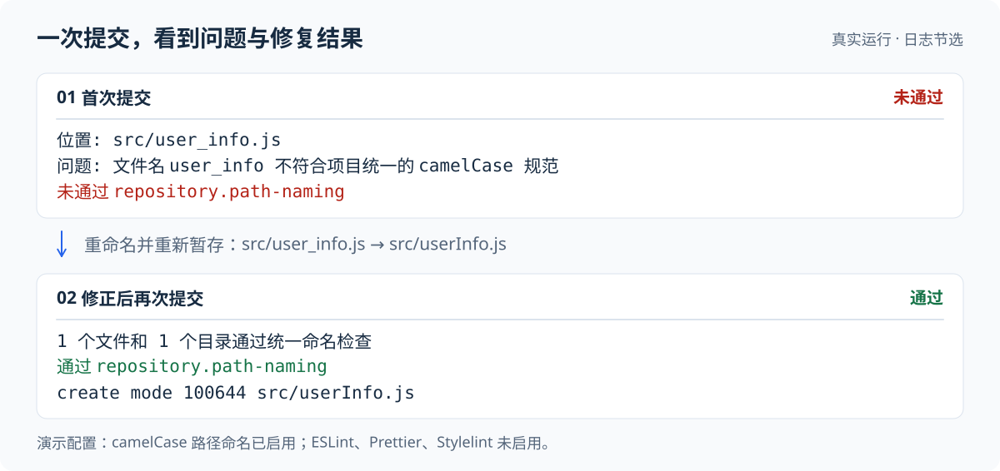
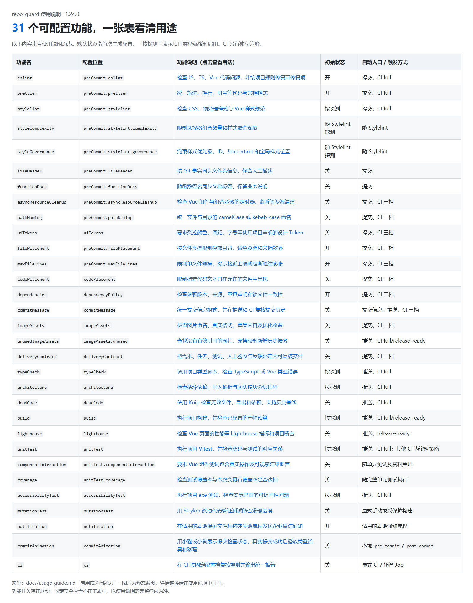
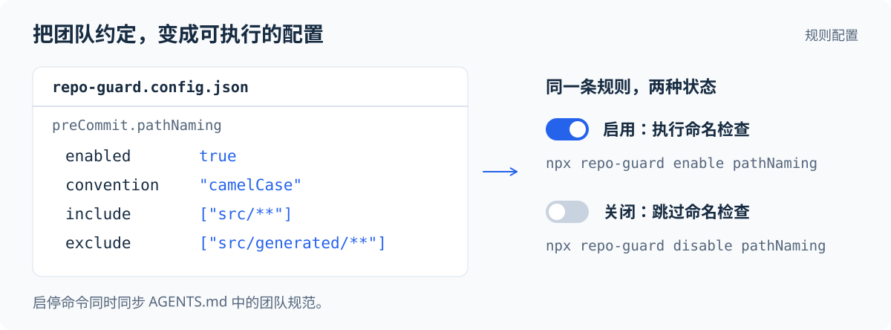
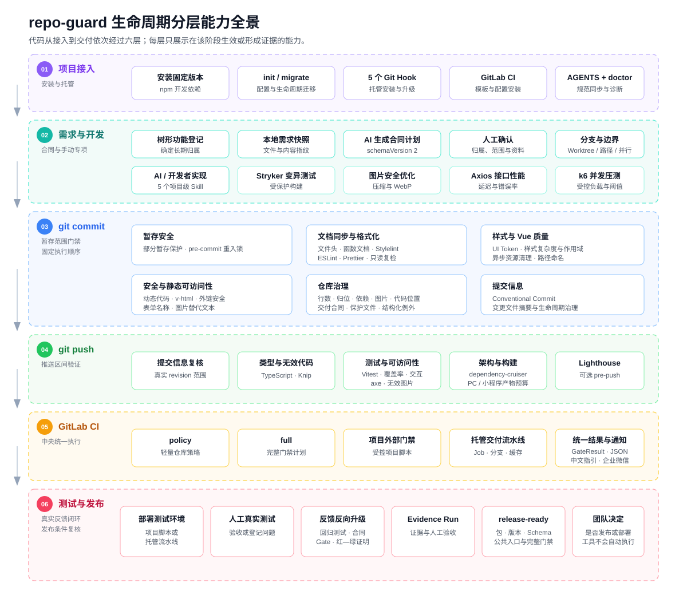
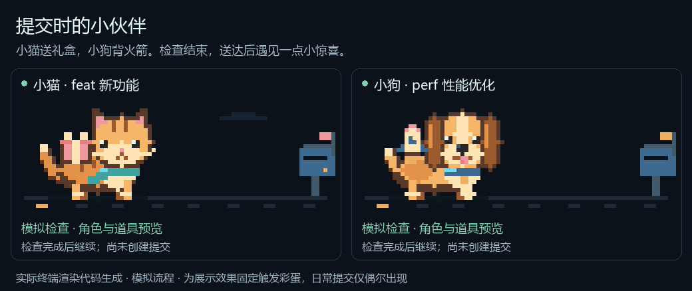

# repo-guard

**把团队的开发规范变成自动检查。**

repo-guard 是通过 npm 安装的 **团队工程规范与交付检查工具**，用于 Vue 前端、Node.js 后端和 Java Maven 后端。人或 AI 明确配置项目身份与团队要求，它在 Git 提交、推送和 CI 阶段检查代码格式、目录规范、依赖、测试和构建，让不同成员和 AI 按同一套要求开发。

**前后端各管自己的工程规则，共同遵循一份交付合同。** 同仓不同目录、独立仓库都可以接入；前端的格式、依赖和测试要求不会自动套用到后端。交付合同可以单独开启，也可以与工程检查同时开启，Java、Python 后端都能参与需求、任务、联调与验收；Java Maven 已有独立工程检查，Python 暂不提供内置工程预设。

| 使用方式 | 检查内容 |
|---|---|
| 只开启工程检查 | 应用自己的代码规范、保护规则、测试和构建 |
| 只开启独立交付合同 | 共同需求、本方任务、代码版本、完成证据、联合验证与人工验收 |
| 两者同时开启 | 实际工程检查结果进入交付证据；关闭或跳过必需检查不能冒充完成 |

接入示例见[前后端隔离配置](docs/features/project-workspace.md)和[独立交付与跨仓库协作](docs/features/delivery-contract.md#独立交付与跨仓库协作)。

例如，团队要求文件统一命名、代码格式一致、提交信息符合约定。配置好以后，成员照常使用 `git commit`：工具执行已启用的提交检查，自动修复可修复的格式问题；需要人工处理的问题会给出中文提示，阻断性检查未通过时，本次提交会被拦下。

检查结果使用统一退出码：`0` 成功或无需阻断，`1` 配置或工具运行错误，`2` 规则或交付条件未满足，`3` Git 范围不可信。手动检查、Hook、CI 和交付入口采用相同含义，多应用结果按固定优先级汇总，便于 AI 判断下一步该修代码、补证据还是修环境。详见[结果与退出码](docs/features/gate-result-and-reporting.md)。

多应用 CI 继承仓库的默认执行模式；子应用只调整某个 Gate 时，其余 Gate 仍使用仓库默认模式，只有显式填写应用 `defaultMode` 才覆盖该默认值。具体 Gate 的覆盖始终按仓库或应用分别配置。详见[CI 策略](docs/features/gitlab-ci.md)。

工具从所选应用及其祖先的 `node_modules` 按就近顺序解析，支持工作区依赖提升和包目录链接；缺少或损坏的安装会明确报错。Git 快照读取失败与配置确实不存在分开处理，中文错误说明与第三方原始诊断分别展示。子进程超时或取消后使用统一清理时限，无法确认完整退出时报告执行错误。详见[应用工具解析](docs/features/project-workspace.md#应用工具如何定位)和[执行失败处理](docs/features/gate-result-and-reporting.md#执行失败与原始诊断)。

无论代码由开发者还是 AI 编写，都按同一套约定接受检查。你可以用它做三件事：

- **按项目选择规则**：提供 **50 个可配置功能**，其中 18 项为 Java 专用检查。按应用的技术栈启用能力、调整范围和要求，例如约束 Java 文件与目录命名、检查字节码缺陷或验证测试能否发现错误。
- **统一团队规范**：把约定保存在项目配置中，在提交前自动检查，减少人工反复提醒和代码评审中的基础问题。
- **管理完整交付过程**：按需关联需求、开发任务、测试结果、人工验收和反馈，让发现的问题推动下一轮需求、测试与规则改进。

[看看实际效果](#提交检查示例) · [安装](#安装) · [50 项可配置功能](#配置规则) · [Java 检查](#java-后端检查) · [交付流程](#完整交付闭环) · [猫狗动画](#提交时的小伙伴) · [功能](#功能) · [使用说明](docs/usage-guide.md)

## 提交检查示例

假设团队已启用文件命名检查，要求使用 `camelCase`，也就是 `userInfo.js` 这样的小驼峰名称：

1. 开发者新增 `src/user_info.js`，暂存后执行 `git commit`。
2. repo-guard 发现名称不符合要求，指出文件位置和修改建议，阻止本次提交。
3. 开发者将文件改为 `src/userInfo.js`，同步修改引用，重新暂存并提交；命名检查通过。



*图中节选自独立演示仓库的真实 Git Hook 输出，经过排版。本例只展示路径命名检查，ESLint、Prettier 和 Stylelint 未启用。*

同样的方式也可以用于提交信息、文件存放位置、依赖声明等团队要求。**具体检查什么，由启用的能力、配置和执行阶段共同决定。**

## 安装

在要接入的 Git 项目根目录执行，需要 Node.js `>=22.23.2`：

```bash
npm install --save-dev --save-exact @cxyi7/repo-guard@2.0.0
npx repo-guard init --project web --role frontend --stack node --preset vue-javascript
npx repo-guard doctor
```

上面是 Vue JavaScript 前端的示例。Node TypeScript 后端将初始化命令换为：

```bash
npx repo-guard init --project api --role backend --stack node --preset node-typescript
```

- `init` 按明确选择的预设创建配置，安装 Git Hook，让相应检查在 Git 操作时自动执行；同时同步项目脚本和 `AGENTS.md` 中供开发者与 AI 阅读的团队规范。
- `doctor` 检查配置、依赖与托管文件是否就绪，告诉你还需要补齐什么。

repo-guard 使用项目已有的工具：Node 项目使用 ESLint、Prettier、Stylelint 及测试、构建脚本；Java 项目使用自己的 JDK 与 Java 检查工具。安装这个包后，仍需按 `doctor` 提示准备对应依赖与配置。Node 预设首次初始化会启用部分基础检查，Java 的工程检查默认关闭；已有非托管 Hook 会提示冲突。详见[接入准备与默认开关](docs/usage-guide.md#快速开始)。

项目与工作区配置只支持 `version: 2`，不提供旧配置转换命令或兼容执行。已有旧配置会被拒绝且保持原文件不变；请人工保存原资料，按新架构重新建立配置。详见[配置管理与规则启停](docs/features/configuration-management.md)。

本版也统一使用 v2 功能登记表、托管 Skill 清单、UI Token 清单、基线和检查报告；外部门禁使用 `repo-guard-json-v2`。Hook 只接受当前 v5 标记，AGENTS 只接受当前托管区块，不再识别旧标记作为可升级文件。

准备完成后，照常暂存和提交代码：

```bash
# 将示例路径换成这次实际修改的文件
git add src/utils/userInfo.js
git commit -m "feat: 添加用户信息"
```

检查未通过时，根据提示修复、重新暂存并提交。提交阶段的格式修复通过 `lint-staged` 处理暂存内容，保留部分暂存和未暂存改动。

- 当前源码版本：`2.0.0`
- npm 包：[`@cxyi7/repo-guard`](https://www.npmjs.com/package/@cxyi7/repo-guard)

## 配置规则

**50 个可配置功能，按应用需要选择。** 包含原有 31 项前端、Node 与通用能力、18 项 Java 能力，以及仓库级文件归位；不同技术栈的专用检查不会互相套用。

[](docs/images/configurable-features-table.png)

*上图展示原有的 31 项能力，点击可查看大图。Java 检查见下方；全部 50 个可复制功能名、用法和开关联动见[使用说明 · 能力开关表](docs/usage-guide.md#启用或关闭能力)。*

单应用的团队约定保存在项目根目录的 `repo-guard.config.json` 中。多应用分别维护自己的工程规则，根配置只保存公共约定。提交这些配置，让同一应用的成员和 AI 使用同一套要求。

例如，“整个仓库的 SQL 只能放在 `database/sql/`”可使用根配置 `repository.filePlacement`。它覆盖前端、后端和公共目录；提交时连同历史上未修改的已跟踪文件一起检查，应用自己的例外不能覆盖根规则。字段说明与配置示例见[仓库级文件归位](docs/features/repository-file-placement.md)。

例如，按项目需要启用或关闭文件命名检查：

```bash
# 启用
npx repo-guard enable pathNaming

# 关闭
npx repo-guard disable pathNaming
```



开关决定是否自动检查，配置决定检查什么。路径命名可以选择 `camelCase` 或 `kebab-case`，指定检查目录，并排除生成文件。启用后会检查范围内的全部 Git 已跟踪路径，包括新暂存文件；存量命名也需要符合约定。字段、可填值和完整示例见[路径命名配置](docs/features/path-naming.md)。

`enable` / `disable` 会保存配置并同步团队规范。直接编辑配置后，执行以下命令同步并检查就绪状态：

```bash
npx repo-guard doctor --fix
npx repo-guard doctor
```

动态代码检查适用于 Node 技术栈。Vue 的 `v-html`、新窗口链接、表单标签和图片替代文本检查只适用于前端；这些硬性检查不计入 50 个开关。

### Java 后端检查

Java 使用独立的 `java-maven` 预设。repo-guard 由 Node 运行，Java 检查调用项目准备好的 JDK、Maven、Checkstyle、PMD 和格式化工具。纯 Java 仓库可以使用全局 CLI，无需为了工程身份创建 `package.json`：

```bash
repo-guard init --project api --role backend --stack java --preset java-maven
repo-guard doctor
```

| 类别 | 可以开启的检查 |
|---|---|
| 源码规范 | 格式与文本卫生、命名、包与路径、导入、文件与方法规模、Javadoc、明确的静态问题、重复代码 |
| 工程约束 | 架构规则、依赖与插件策略、文件存放与禁止产物入库 |
| 可执行验证 | 编译、构建产物、单元与集成测试、覆盖率 |

Java 的 18 项检查默认关闭；先由人或 AI 准备工具与基础配置，再按需开启。源码格式修复只作用于本次暂存文件；编译、构建、测试、覆盖率、SpotBugs 和 PIT 留在推送、CI 或手动检查。必需测试没有运行、报告过期或缺失、工具启动失败均会阻断，不能只凭命令返回成功就通过。

Maven 检查共用启动配置预检，防止 `.mvn` 文件或环境参数暗中关闭规则。遇到不支持的覆盖会明确提示调整位置；允许的资源参数与配置方式见 [Java 工程检查](docs/features/java-engineering.md)。

检查失败时，Java 工程报告提供所属模块、报告或文件位置、具体证据及修复建议；第三方原始退出码独立保留为诊断，对外仍使用统一退出码。应用直接位于仓库根目录时，`AGENTS.md` 同时包含公共提交、交付及文件归位规范，应用工程配置仍独立维护。

- [Java 文件与目录命名](docs/features/java-path-naming.md)：类文件使用大驼峰、包目录使用小写，还可要求指定目录的文件必须带 `Controller`、`Service` 等后缀；与[文件归位](docs/features/file-placement.md)及[保护文件](docs/features/protected-files.md)分别配置。
- [SpotBugs 字节码检查](docs/features/java-spotbugs.md)：查找空指针、资源释放、对象比较等缺陷模式，按团队配置的优先级阻断。
- [PIT 变异测试](docs/features/java-mutation-test.md)：对代码制造小幅变异，验证已有测试能否发现错误，逐模块检查变异得分。

完整字段、工具前置条件及规则边界见 [Java 接入说明](docs/java-quality-integration.md)，完成情况与现场复核见 [Java 验收清单](docs/java-check-acceptance.md)。本轮提供检测能力，自动安装与配置适配由后续 Skill 负责；Gradle 工程预设和 Java 运维部署暂未接入。

### 前后端如何一起用

单独仓库各自配置即可。同一仓库明确登记 `apps/web` 和 `apps/api`：前后端各自配置代码规则、依赖、例外、保护文件和外部门禁。根目录统一提交信息、CI 流程、通知与动画，并保护必要的公共配置。不同应用的源码目录不能重叠。

应用目录的 `apps/web`、`./apps/web`、`apps//web` 等价写法会统一后再匹配 Git 变更，避免因路径写法不同漏掉提交检查；配置文件保留原写法。

```bash
# 只检查后端；使用后端目录内的工具、源码与脚本
npx repo-guard ci --project api --profile full
```

提交、推送及普通 CI 根据变更选择受影响应用；根清单变化触发所有应用，共享文件可用 `sharedPaths` 指定影响范围。只改前端时不会读取无关后端的工具与工程规则。`release-ready` 默认复核全部应用，也可以用 `--project` 明确只验证本方。CI 质量检查与运维发布分开：`repo-guard.ops.json` 为各应用声明构建产物、环境和部署脚本，前后端可以独立发布、由不同成员负责。

独立运维可显式开启整条流水线的成功、失败通知，覆盖合并请求与分支流水线；升级后需重新生成托管片段，见[运维通知与更新说明](docs/features/operations.md#流水线通知)。

接入示例见[前后端与多应用配置](docs/features/project-workspace.md)。当前接入范围为通用工程检查，不判断接口输入输出、身份权限或业务是否正确。Java 与 Node 使用各自的检查器；依赖自动安装将在后续 Skill 中实现。

## 完整交付闭环

如果团队还需要回答“这个需求做完了吗、测试依据在哪里、反馈修复了吗”，可以启用交付流程，把相关资料与代码一起保存在 Git 中。

这项能力称为**交付合同**：一组记录“要做什么、如何验收、实际完成了什么”的项目文档。团队填写和确认这些资料，repo-guard 检查其中的关联、约束与执行证据。



| 阶段 | 团队怎样使用 |
|---|---|
| 需求 | 写清目标、范围和验收条件，确认这次要交付什么 |
| 开发 | 把需求拆成任务，由开发者与 AI 实现，并按团队规范提交 |
| 测试 | 执行项目测试与实际验证，记录结果，处理发现的问题 |
| 发布 | 用 `release-ready` 复核交付要求和证据，由团队决定并执行发布 |
| 反馈 | 把测试或使用中发现的问题关联到任务，修复后重新验证 |
| 反向升级 | 根据问题完善需求、设计、测试或检查规则，供下一轮开发使用 |

例如，用户反馈表单漏了必填校验：团队补充需求约定，修复代码并增加回归测试；如果其他表单也可能出现同类问题，再评估是否增加统一检查规则。反馈也可以直接来自测试阶段。

**人负责确认需求、验收和改进决定，开发者与 AI 负责实现和修复，repo-guard 负责检查约定及证据，Git 保存代码与资料的版本记录。**

交付合同默认关闭。跨仓协作用独立的 `repo-guard.delivery.json`：前后端绑定同一合同的固定版本，各自执行检查、交换签名证据，再针对明确的代码版本组合完成联合验证与人工验收。Java、Python 项目也可只使用此入口，运行 CLI 仍需 Node。

本仓库内的多文件合同包使用 `repository.deliveryContract`，通过 `enable deliveryContract` 启用。两种组织方式任选一种；不能在同一仓库同时启用。初始化、字段和完整操作见[交付合同手册](docs/features/delivery-contract.md)。

<a id="提交时的小伙伴"></a>

## 提交时的小伙伴 

检查时，小猫或小狗在终端里小跑、摇尾；Git 创建提交后送达包裹，偶尔出现流星、蝴蝶或烟花。检查失败时停止动画，保留完整问题与修复提示。



*动图由实际终端渲染代码生成，使用模拟流程并固定展示彩蛋。真实检查阶段使用普通包裹，成功后按提交类型切换道具；彩蛋仅偶尔出现。*

动画默认关闭，可随时启停；CI 和非交互终端使用文字输出。安装后可以先预览，不会检查项目或创建提交：

```bash
npx repo-guard animation-preview --theme cat --type feat
npx repo-guard animation-preview --theme dog --type perf
```

启用方法、猫狗主题和十种提交道具见[提交动画使用指南](docs/features/commit-animation.md)。

## 功能

从要解决的问题选择能力，具体配置放在对应文档中：

| 你想解决的问题 | 可用能力 | 说明 |
|---|---|---|
| 每个人的代码格式、文件命名和目录习惯不同 | 格式检查与修复、路径命名、文件归位、行数限制 | [代码与团队规范](docs/usage-guide.md#常用使用方式) |
| 提交信息不统一，AI 缺少明确的项目约定 | 提交信息检查、AGENTS 规范同步 | [提交信息](docs/features/commit-message.md) · [团队规范](docs/features/managed-agent-policies.md) |
| 页面颜色、间距、字号各写各的，AI 随意使用数值 | 样式 Token 检查，支持原生 CSS、SCSS/Sass、Less | [样式 Token](docs/features/ui-tokens.md) |
| Vue 代码容易遗漏资源清理和安全要求 | 异步资源清理、安全与可访问性检查 | [能力索引](docs/features/README.md#提交阶段质量与安全) |
| 图片重复、文件无效、依赖声明混乱 | 图片治理、无效图片与代码检查、依赖策略 | [仓库与代码治理](docs/features/README.md#仓库与代码治理) |
| 测试、构建和性能要求靠人工记忆执行 | 类型检查、测试与覆盖率、架构、构建预算、Lighthouse、接口压测 | [测试与性能](docs/features/README.md#测试构建与性能) |
| CI 与本地规范脱节，交付依据难以追踪 | CI 规则复核、GitLab 流水线、交付合同与发布前检查 | [GitLab CI](docs/features/gitlab-ci.md) · [交付合同](docs/features/delivery-contract.md) |

**已有 ESLint、Prettier 和测试工具，怎样配合使用？** repo-guard 调用项目自己的安装与配置，补充文件、仓库及交付规则，统一安排检查时机并输出结果。首次接入需要准备哪些工具，见[接入准备](docs/usage-guide.md#准备项目工具)。

**这些检查在什么时候运行？** 提交前执行格式修复和适用的代码、仓库规则检查；类型检查、测试、架构、构建等较重任务放在推送、CI 或手动入口，Lighthouse 也不进入提交前检查。实际执行由配置和入口决定，完整顺序见[检查执行说明](docs/usage-guide.md#固定执行顺序)。

## 文档

| 文档 | 内容 |
|---|---|
| [使用说明](docs/usage-guide.md) | 安装、配置、日常操作与排查问题 |
| [功能说明索引](docs/features/README.md) | 各项能力的用途、字段说明和执行要求 |
| [交付合同手册](docs/features/delivery-contract.md) | 需求到反馈的接入方式、角色分工与完整流程 |
| [维护者架构说明](docs/project-structure-and-feature-inventory.md) | 代码结构、模块职责与依赖关系 |
| [2.0 重构工作清单](docs/refactor-2.0-remaining-work.md) | 原生 v2 模型、旧兼容移除、独立运维及回归验收记录 |
| [更新日志](CHANGELOG.md) | 各版本的变更记录 |

## 贡献与反馈

欢迎通过 [GitHub Issues](https://github.com/cxyi7/repo-guard/issues) 提交问题或建议。请附上版本、触发命令、预期与实际结果，以及脱敏后的最小复现。

参与开发前请阅读 [AGENTS.md](AGENTS.md)。在本仓库执行以下检查；行为变化需同步测试与文档：

```bash
npm ci
npm run check
npm test
npm run pack:check
```

## 许可证

[MIT](LICENSE) © cxyi7
