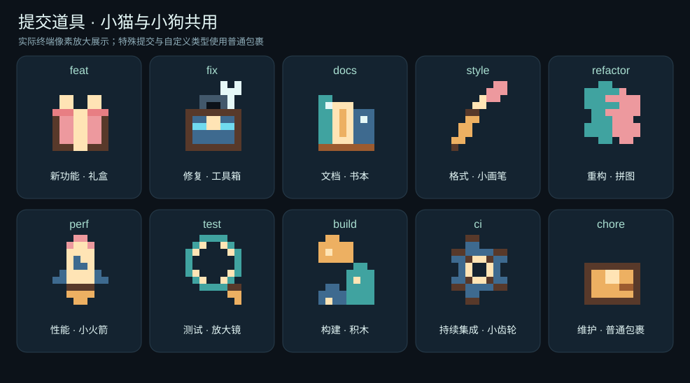

# 提交动画：小猫与小狗

[返回使用说明](../usage-guide.md) · [功能索引](README.md)

让终端中的小猫或小狗陪伴提交检查，成功后送达包裹。默认关闭，可以随时启停；它是展示功能，不是新门禁，不改变规则、执行顺序、退出码或暂存范围。

## 先预览，再启用


动图由当前终端渲染代码生成，模拟检查与送达，并固定展示蝴蝶和烟花彩蛋；没有执行检查或创建提交。预览可以提前指定道具，真实检查阶段使用普通包裹，成功后才按提交类型切换，彩蛋仅偶尔触发。

在包含此功能的版本中运行以下命令。预览不读取项目配置、不执行门禁、不创建提交；失败示例也属于成功完成预览，退出码为 0。

```bash
npx repo-guard animation-preview --theme cat --type feat --egg meteor
npx repo-guard animation-preview --theme dog --type fix --egg butterfly
npx repo-guard animation-preview --theme cat --type docs --egg fireworks
npx repo-guard animation-preview --theme dog --fail
```

`--theme` 只接受 `cat`、`dog`，默认 `cat`；`--type` 接受下方道具表中的全部 10 种类型，默认 `feat`；`--egg` 仅用于预览，可选 `auto`、`none`、`meteor`、`butterfly`、`fireworks`，默认 `auto`，不会改变真实提交的彩蛋规则。`--fail` 播放失败示例并禁止庆祝；`--plain` 只输出文字。未知选项和非法值会报配置错误。

```bash
npx repo-guard enable commitAnimation
npx repo-guard install-hooks
npx repo-guard doctor
# 随时关闭
npx repo-guard disable commitAnimation
```

当前 `post-commit` 使用 `hook-message success`，安装器只接受并生成 v5 Hook。旧版本、混合标记或非托管 Hook 会被拒绝并保留，需人工确认后按当前入口重新接入，不会自动升级。`hook-message cleanup` 仅负责清理，不播放成功动画。启停命令同步配置与托管规范，但不自动覆盖 Hook。

## 配置及字段说明

以下是带注释的说明示例，合并到已有 `repo-guard.config.json` 时删除注释，保留标准 JSON。

```jsonc
{
  "reporting": {
    "commitAnimation": {
      "enabled": true, // 布尔值；默认 false，控制整项动画与成功提示
      "theme": "dog", // cat 小猫 / dog 小狗；默认 cat，没有 signal 主题
      "commitTypeProps": true // 布尔值；默认 true，成功后按提交类型切换道具
    }
  }
}
```

| 字段 | 用途、可填值与约束 |
|---|---|
| `reporting.commitAnimation.enabled` | `true` 开启、`false` 关闭，不能使用字符串。关闭动画不关闭任何检查。 |
| `reporting.commitAnimation.theme` | `cat` 为橘色小猫，`dog` 为垂耳小狗；不支持任意脚本、文件路径或外部主题。 |
| `reporting.commitAnimation.commitTypeProps` | `true` 时按成功提交的标题识别类型；`false` 始终使用普通包裹。 |

省略字段使用默认值；未知字段、`null` 或非法类型都会报错。若使用过早期开发版示例，请删除 `successEgg` 和 `eggChance`；正式配置不再提供彩蛋字段。没有音效、桌面弹窗或额外网络请求。

## 真实提交中的表现

| 阶段 | 显示行为 | 结果含义 |
|---|---|---|
| `pre-commit` 暂存质量检查 | 角色原地小跑、摇尾，显示正在检查；质量子步骤作为一个阶段展示 | 不根据耗时估算百分比；格式化和规则验证仍按固定顺序执行 |
| 最终策略检查 | 按实际结束的阶段推进位置，输出每项原有报告；跳过的阶段也算已结束 | 很快完成的同步检查可能没有连续动画 |
| 质量或策略失败 | 停止角色，恢复光标，保留完整问题、证据、修复约束和验证指导 | 提交被阻止；没有成功动作或彩蛋 |
| `commit-msg` | 保留原有提交信息校验和失败报告 | 此时仍不能声明提交成功 |
| `post-commit` | 读取 Git 已创建提交的标题，送达并偶尔触发内置彩蛋 | 只代表本地提交创建成功，不代表推送、CI、发布成功 |

检查前无法可靠取得最终提交信息，因此使用普通包裹；不会读取上一条遗留消息猜测本次类型。道具覆盖项目默认的 10 种提交类型，标题语法与提交信息校验共用解析函数，支持作用域和破坏性变更标记，如 `feat(ui)!:`。合并、回退、临时整理提交和自定义未知类型统一使用普通包裹，不设计专属道具，不改变这些提交的校验策略。完整标题不会写入动画画面。

成功彩蛋是代码内置的小惊喜，低概率随机触发，类型和概率不向用户提供配置。每次真实提交成功只进行一次触发判断，触发后在流星、蝴蝶、烟花中随机选择一种。没有彩蛋时送达约 0.75 秒；有彩蛋时约 3.2 秒。检查动画不人为延长检查；输出完整报告前清除活动画面，不用截断报告为角色腾空间。

## 提交类型与道具



| 类型 | 用途 | 道具 |
|---|---|---|
| `feat` | 新功能 | 礼盒 |
| `fix` | 修复问题 | 工具箱 |
| `docs` | 文档 | 书本 |
| `style` | 格式调整 | 小画笔 |
| `refactor` | 重构 | 拼图 |
| `perf` | 性能优化 | 小火箭 |
| `test` | 测试 | 放大镜 |
| `build` | 构建 | 积木 |
| `ci` | 持续集成 | 小齿轮 |
| `chore` | 日常维护 | 普通包裹 |

两种角色共用同一套道具，背负与送达图案一致。检查阶段尚未取得提交标题，始终使用普通包裹；只有提交成功后按实际标题显示上述道具。

## 兼容与排查

- 需要至少 60 列 × 22 行、支持 256 色或真彩色的交互终端；Windows Terminal 可运行。终端字体应支持半方块字符 `▀`。
- CI、输出重定向、`TERM=dumb`、设置 `NO_COLOR`、颜色能力不足或窗口太小时，不写动画控制字符，继续原有文字报告。
- 窗口缩放后本次停止动画，避免折行后覆盖历史日志；下次运行重新检测。背压时跳过动画帧，避免输出队列持续增长。
- 不接管键盘。收到 `SIGINT`（通常由 `Ctrl+C` 触发）或 `SIGTERM` 时先恢复光标，再交给已有取消处理器；没有其他处理器时重新交付原信号，保持正常退出。输出错误、能力检测或绘制异常会停止动画且不留下计时器；检查结果仍由门禁决定。
- 提交后入口只有成功读取 Git 提交记录才显示成功，空仓库或读取失败时不庆祝。
- 若只有检查动画而没有成功动作，先核对当前 v5 Hook 的 `post-commit` 是否连接 `hook-message success`；当前托管 Hook 可重复安装，旧标记或冲突文件需保留后人工重新接入。若使用 GUI 提交且输出不是终端，文字降级属于正常行为。
- 成功前出现失败时，优先阅读报告中的文件位置、预期与修复建议。不要通过关闭检查、跳过 Hook 来让角色显示成功。

## 维护依据

[配置验证](../../src/config/commit-animation-validation.js) · [终端渲染](../../src/core/report/commit-animation/presenter.js) · [预提交编排](../../src/orchestration/pre-commit/runner.js) · [提交后入口](../../src/orchestration/commit-message/runner.js) · [动画测试](../../test/hooks/commit-animation.test.js) · [暂存区集成测试](../../test/hooks/pre-commit.test.js)
