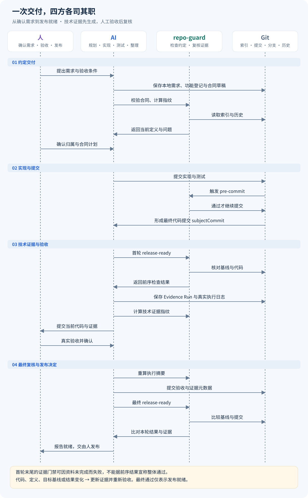
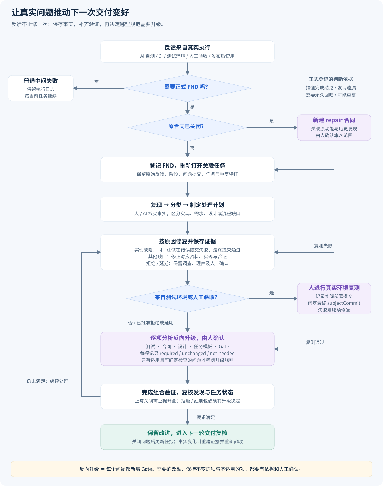

# 交付合同手册

把一次交付的需求、实现、测试、验收和反馈放在同一条可追溯流程中。**人确认业务与验收，AI 执行并整理证据，repo-guard 校验约定，Git 保存版本事实。**

[返回使用说明](../usage-guide.md) · [功能索引](README.md)

> 阅读约定：示例保持标准 JSON，字段说明紧随其后。默认值指省略字段时的补缺值，不等于示例值；首次初始化可能按工具就绪情况启用。主配置片段需合并到原文件，数组整项替换。

[接入](#接入与配置) · [角色分工](#角色分工与交付时序) · [功能登记](#功能登记与合同规划) · [证据复核](#交付证据与两轮复核) · [反馈升级](#真实测试反馈与反向升级) · [字段格式](#字段与文件参考)

本页统一维护功能登记、合同门禁、交付证据和真实反馈，覆盖当前 `schemaVersion: 2` 多文件合同包。它们是一套交付流程中的不同环节，共用 `deliveryContract` 配置。目录分文件用于控制规模和保存历史，阅读与维护入口集中在本页。

## 接入与配置

以下主配置片段应合并到 `repo-guard.config.json`；单独标注的文件按指定路径保存。直接编辑配置后运行 `npx repo-guard migrate` 和 `npx repo-guard doctor`。

合同驱动交付默认关闭。启用后，项目用树形功能登记表记录人工确认的功能归属，并用当前分支唯一的 `schemaVersion: 2` 多文件活动合同约束本地需求快照、资料计划、Git 历史修订、目标分支、Worktree、路径边界、执行清单、并行协调和发布证据：

```json
{
  "deliveryContract": {
    "enabled": true,
    "registryPath": "docs/delivery/feature-registry.json",
    "contractsDirectory": "docs/delivery/contracts",
    "requiredFor": ["src/**", "test/**", "package.json"],
    "exclude": ["reports/**"]
  }
}
```

<!-- config-fields:start -->
**字段说明**（以下字段位于 `deliveryContract` 内）：

| 字段 | 用途 | 可填值与默认值 | 约束与要求 |
|---|---|---|---|
| `enabled` | 是否启用 repository.delivery-contract 和 release.delivery-evidence | `true` / `false`<br>默认：`false` | 使用 JSON 布尔值，不能写成字符串 "true" / "false" |
| `registryPath` | 仓库相对的树形功能登记表 JSON 路径 | 字符串<br>默认：`"docs/delivery/feature-registry.json"` | 仓库相对路径；不能是绝对路径或含 .. 越界，使用 / 分隔；以 .json 结尾 |
| `contractsDirectory` | 保存 Markdown 交付合同、Evidence Run、执行报告及本地需求快照的仓库相对目录 | 字符串<br>默认：`"docs/delivery/contracts"` | 仓库相对路径；不能是绝对路径或含 .. 越界，使用 / 分隔 |
| `requiredFor` | 命中任一 glob 的当前变更必须由唯一交付合同覆盖；空数组表示不自动要求合同 | 字符串数组<br>默认：`["**/*"]` | 允许空数组；元素不可重复；每项为非空字符串 |
| `exclude` | 不触发合同选择的生成物范围；选定合同后不会因此绕过 allowedPaths 或 forbiddenPaths | 字符串数组<br>默认：`["reports/**"]` | 允许空数组；元素不可重复；每项为非空字符串 |

<!-- config-fields:end -->

```bash
npx repo-guard enable deliveryContract
npx repo-guard delivery-contract
npx repo-guard delivery-evidence
```

启用命令会同步安装五个项目级 Skill 到 `.agents/skills/`：功能登记、合同规划、合同执行、反馈闭环和交付证据。每个 Skill 使用标准 `SKILL.md` 入口，并按实际需要带 `agents/openai.yaml`、`references/` 和 `assets/`；`.repo-guard/managed-skills.json` 保存逐文件指纹。资产模板使用明确的 `<REQUIRED_*>` 和 `pending` 保持默认不可通过，必须换成当前仓库事实并由人工确认，不能把零哈希或虚构时间当成起始值。迁移、初始化和 `doctor --fix` 会安全升级，Doctor 会检查缺失或篡改；禁用时只删除仍与托管指纹一致的文件，拒绝覆盖或删除人工修改。

主合同与合同 id 子目录组成一份逻辑合同，分别保存需求快照、追踪关系、执行清单、正式发现和证据。接入后按以下分工完成规划、开发、验收与反馈；完整目录和字段集中在本页后半部分。

## 角色分工与交付时序

| 参与者 | 负责什么 | 保存的结果 |
|---|---|---|
| 人（产品、研发负责人、测试） | 确认需求与归属、审批合同定义、真实环境验收、确认反馈处理和升级、决定发布 | `HUMAN-PLAN-*`、`HUMAN-ACCEPT-*`、必要的 `HUMAN-RETEST-*` 与审批记录 |
| AI（或承担执行工作的开发者） | 整理需求快照、起草计划、实现与测试、登记发现、分析影响、整理真实执行证据 | 源码、测试、合同资料、FND、Evidence Run；人工项必须依据真实确认记录 |
| repo-guard | 计算指纹，检查路径/版本/任务/证据约束，执行配置中的门禁，复核本轮结果 | 中文问题与修复提示、GateResult、发布就绪结论 |
| Git | 保存需求、代码、测试、合同和证据的版本，提供索引、提交历史、分支与基线；触发已安装 Hook | 可解析的提交及差异；业务批准不由 Git 作出 |

以下以已启用合同、已安装 Hook 的一次正常交付为例。反馈处理进入后面的独立流程，发布由团队在就绪后决定。



[查看完整时序图](../images/repo-guard-delivery-sequence.svg) · [可编辑 Mermaid 源文件](../images/repo-guard-delivery-sequence.mmd)

## 功能登记与合同规划

1. **人明确业务目标。** 提供需求来源、范围和可验收结果；AI 整理本地快照与候选归属，不能仅凭远端链接声称取得需求事实。
2. **确认功能登记。** `feature-registry.json` 保存长期功能树；`children` 是下级功能，`deliveryContracts` 是关联交付。功能归属和资料来源由人确认，同一功能可关联多份历史合同。
3. **规划本次合同。** 一次可独立验收、发布或回滚的变更形成一份合同，类型为 `feature`、`enhancement`、`repair`、`refactor` 或 `maintenance`。绑定当前分支、基线、目标分支、路径边界和资料计划；当前分支只能匹配一份活动主合同。
4. **确认资料与定义。** 按实际需要选择 Spec、Design、Tasks、Examples、Visuals 的 `inline/file/reference/not-needed` 形式。repo-guard 复算当前定义，人确认后再按合同执行。需要改变定义时提升修订并重新确认，不能沿用旧批准扩大范围。
5. **实现与验证。** AI/开发者按任务实现并留下可核对证据；提交仍需遵守同一套团队规则。确认过的义务、正式发现与历史需求修订应保留。

登记表示功能的长期身份，合同表示本次交付；文件格式见下文。分支并行、路径重叠和目标分支前进时，还需补齐协调、影响分析及回归证据。

## 交付证据与两轮复核

**先形成技术证据供人验收，再对验收后的完整记录进行最终复核。** 一次终端“通过”或截图不能替代当前代码与合同绑定的证据。

| 步骤 | 操作与执行者 | 完成条件 |
|---|---|---|
| 1. 固定需求与计划 | AI 暂存需求、登记和初始合同，运行 `delivery-contract`；人确认定义与计划 | 来源 SHA-256、整批指纹、`definitionDigest` 与人工确认对应当前事实 |
| 2. 固定待验收代码 | AI/开发者实现、测试、处理正式发现并提交最终功能代码 | `subjectCommit` 指向真实代码；需要部署验证时记录实际部署提交，此时不提前勾选最终验收 |
| 3. 第一轮检查 | AI 运行下方首轮 `release-ready` 命令 | 前序 GateResult 来自当前执行；末尾证据门禁尚未完成时可失败，整体不能宣称通过 |
| 4. 整理技术证据 | AI 从报告的 `steps[*].gateResult` 取得实际引用的完整结果，保存 Evidence Run、执行日志与 `EVD-*`，运行 `delivery-evidence` | 文件、执行和结果指纹可复算，形成当前 `technicalEvidenceDigest` |
| 5. 人工验收 | 人审阅最终代码、当前定义、技术证据与真实测试结果 | `HUMAN-ACCEPT-*` 绑定本次事实；AI 可整理记录，不能替人确认 |
| 6. 固定验收记录 | AI 再运行 `delivery-evidence` 更新 `executionDigest`，提交允许的证据元数据 | 人工项与发现状态进入新摘要；功能代码没有继续改变 |
| 7. 最终复核 | AI 再运行 `release-ready` | 目标分支等于当前集成基线，实际 GateResult 与 Evidence Run 一致，全部要求满足 |
| 8. 发布决定 | 人审阅就绪结果，按项目发布流程执行 | 实际部署或 npm 发布由项目流程完成，repo-guard 本命令只给出就绪结论 |

准备好[发布就绪条件](release-ready.md)后，首轮结果采集与后续复核命令为：

```bash
npx repo-guard ci --profile release-ready --report-json reports/release-ready-evidence.json
npx repo-guard delivery-evidence
```

两条命令之间和之后都需要按上表整理证据与完成人工验收，不是直接连跑就能交付。验收完成后再次运行 `delivery-evidence` 更新摘要，提交允许的元数据，再执行：

```bash
npx repo-guard ci --profile release-ready
```

`subjectCommit` 之后只允许指定合同及证据元数据提交。代码、测试、需求、设计、目标基线或结果变化时，回到受影响步骤，重建证据并重新验收。最终检查还要求受跟踪工作区干净。

## 真实测试反馈与反向升级

反馈来自 AI 自测、CI、真实测试环境、人工验收或发布后的使用。处理中间一次普通失败可以留在执行日志；推翻“已完成”的结论、暴露需求/设计/任务/门禁遗漏、需要永久回归或可能重复出现的问题，要登记正式 `FND-*`。



[查看完整反馈流程图](../images/repo-guard-feedback-loop.svg) · [可编辑 Mermaid 源文件](../images/repo-guard-feedback-loop.mmd)

1. **登记真实问题。** 保存原始反馈、发现者、阶段、问题提交、关联任务和重复特征。每条正式发现独立放在 `findings/FND-*.md`。未闭环时重新打开关联的已完成任务；已关闭合同的新反馈由新的 `repair` 合同承接。
2. **复现和分类。** AI/开发者先确认问题条件，区分实现缺陷与需求、设计、任务或规则遗漏，形成修复计划。
3. **修复并保留回归证据。** `implementation-gap` 必须让同一测试在错误提交失败、在最终 `subjectCommit` 通过，分别留下非零与零退出码的真实执行日志。其他原因按分类修正对应资料和验证，不能虚构红—绿记录。
4. **真实环境复测。** `test-environment` 或 `human-acceptance` 阶段的问题必须记录实际部署提交；正常关闭前由人复测，`HUMAN-RETEST-*` 绑定最终 `subjectCommit`。复测失败继续修复并保持任务未完成。
5. **确认反向升级。** 人审阅五个维度的决定及依据，落实需要的改动。拒绝或延期也需保留调查、原因、人工确认和升级结论，不能直接删掉反馈。
6. **重新组合验证。** 证据满足后关闭问题、更新任务状态；影响当前交付事实的变化进入新一轮证据与人工验收。

| 升级维度 | 什么时候需要改 | 应留下什么 |
|---|---|---|
| 测试 | 测试未识别错误或缺少场景 | 永久回归用例和执行证据 |
| 合同 | 需求边界或验收条件不完整 | 合同修订、追踪关系与重新确认 |
| 设计 | 模块职责、交互或异常方案有缺口 | 设计调整和影响验证 |
| 任务模板 | 执行清单漏了必要动作 | 更新模板与后续任务要求 |
| Gate | 问题跨功能重复，可确定检查且误报成本可接受 | 经评审的规则变更、配置说明与测试 |

每个维度都需记录 `required`（需要升级）、`unchanged`（保持现状）或 `not-needed`（不需要），以及结论和人工确认。反向升级可以只增加测试，不要求每个问题都变成全局规则；repo-guard 校验记录与证据，改进决策由人负责。

## 字段与文件参考

以下集中保留当前字段、目录、清单和证据的完整示例。**带占位符、示例日期、示例身份或示例哈希的内容用于解释结构，不能直接作为已完成合同。** 使用托管 Skill 的资产模板起草时，必须替换为本项目事实，并按前面的流程获得真实确认。

## 1. 文件关系

```text
docs/delivery/
├─ feature-registry.json
└─ contracts/
   ├─ DC-20260906-001.md
   └─ DC-20260906-001/
      ├─ spec.md
      ├─ design.md
      ├─ traceability.md
      ├─ obligations.md
      ├─ findings/
      │  └─ FND-20260906-001.md
      ├─ evidence/
      │  ├─ files/
      │  │  └─ EXEC-UNIT-001.txt
      │  └─ runs/
      │     └─ RUN-20260906-001.md
      └─ requirements/
         └─ rev-001/
            ├─ requirements.md
            └─ sources/
               └─ SRC-001__20260906T143022+0800__原始需求.pdf
```

功能登记表保存长期功能身份和归属，交付合同保存一次可独立验收、发布或回滚的交付。一个功能可以引用多份历史合同；当前分支只能匹配一份 `lifecycle: active` 的主合同。

交付合同主 Markdown 必须是 `contractsDirectory` 的直接子文件；同一合同的需求事实、追踪关系、执行清单、逐项发现、Spec、Design 和证据放在以合同 id 命名的子目录中。门禁只把直接子文件识别为合同，再从主合同 `materials` 加载完整合同包；子目录内的 Markdown 不会被误解析为另一份合同。

## 2. 树形功能登记表

每个节点必须完整提供固定字段。`children` 和 `deliveryContracts` 必须分开；没有内容时使用空数组。

```json
{
  "schemaVersion": 1,
  "features": [
    {
      "id": "community-profile",
      "name": "小区资料",
      "status": "active",
      "confirmedAt": "2026-09-06T10:00:00+08:00",
      "confirmedBy": "产品负责人",
      "requirementSource": "https://example.com/community-profile",
      "uiSource": null,
      "description": "维护小区基础信息。",
      "children": [
        {
          "id": "community-library",
          "name": "小区资料库",
          "status": "active",
          "confirmedAt": "2026-09-06T11:00:00+08:00",
          "confirmedBy": "产品负责人",
          "requirementSource": "https://example.com/community-library",
          "uiSource": "https://example.com/community-library-ui",
          "description": "管理归属于具体小区的文件资料。",
          "children": [],
          "deliveryContracts": [
            {
              "id": "DC-20260906-001",
              "path": "docs/delivery/contracts/DC-20260906-001.md"
            }
          ]
        }
      ],
      "deliveryContracts": []
    }
  ]
}
```

<!-- config-fields:start -->
**字段说明**（属于 `feature-registry.json`；所有层级使用相同节点结构）：

| 字段 | 用途 | 可填值 | 约束与要求 |
|---|---|---|---|
| `schemaVersion` | 功能登记表格式版本 | 只能为 `1` | 与主合同的 schemaVersion 2 区分 |
| `features` | 根功能集合 | 功能节点对象数组 | 每个节点必须提供下列固定字段，不接受未知字段 |
| `id` | 功能的长期唯一身份 | 字母开头，后续可用字母、数字、点、下划线、连字符 | 全树唯一；合同 featureId 引用该值 |
| `name`、`description` | 面向人的功能名称与业务说明 | 非空字符串 | 必填，不用内部 ID 代替业务介绍 |
| `status` | 功能当前状态 | `proposed`、`active`、`retired` | proposed 尚未确认，active 可关联当前交付，retired 保存历史 |
| `confirmedAt`、`confirmedBy` | 人工确认时间与身份 | 带时区 ISO 8601 时间和非空身份；或 null | proposed 时两者必须为 null；active/retired 必须填写真实确认 |
| `requirementSource`、`uiSource` | 需求与界面资料入口 | HTTPS 地址、仓库相对路径或 null | 字段必须存在；本地路径不得越界。登记链接不代替合同的本地需求快照 |
| `children` | 下级功能 | 同结构的节点数组 | 无子功能填 []，不能放合同引用 |
| `deliveryContracts` | 此功能关联的交付历史 | 合同引用对象数组 | 无合同填 []，不能放子功能 |
| `deliveryContracts[].id` | 被引用的合同身份 | 稳定合同 ID | 与真实主合同 ID 一致，不能重复登记到不同功能 |
| `deliveryContracts[].path` | 主合同文件位置 | 仓库相对路径 | 必须是 contractsDirectory 的直接子文件，与真实受跟踪合同一致 |

<!-- config-fields:end -->

状态只接受 `proposed`、`active`、`retired`。`proposed` 的确认人和确认时间必须为 `null`；只有经过人工确认的 `active` 功能可以被活动合同引用。功能 id 与合同引用 id 在整棵树中必须唯一。

## 3. 主合同 Markdown Frontmatter

合同必须使用 YAML Frontmatter，`schemaVersion` 固定为 `2`。主合同只保存稳定身份、仓库边界、资料计划、人工确认和最终证据索引；增长型内容保存在组成文件中。下例省略了真实指纹内容：

```yaml
---
schemaVersion: 2 # 格式版本，固定为 2；不能与功能登记表的版本 1 混用
contractId: DC-20260906-001 # 绑定主合同 ID；字母开头，仅含字母、数字、点、下划线、连字符
contractRevision: 1 # 主合同修订号，正整数；定义变更须在 Git 历史上一版基础上加 1
featureId: community-library # 功能归属 ID；必须引用功能登记表中的真实节点
type: feature # 交付类型：feature / enhancement / repair / refactor / maintenance；不是 Git commit type
lifecycle: active # 合同生命周期：active / closed；不是执行进度或发布状态
summary: 首次交付小区资料库。 # 交付目标摘要，非空字符串；说明本次交付的业务结果
relations: {} # 合同关系对象；可填 follows、repairs、dependsOn，各为不重复的非空 ID 字符串数组；无关系填 {}
historicalFeedbackApplied: [] # 历史反馈继承数组；无须继承时填 []，存在历史正式发现时不能遗漏，条目字段见下文
repository: # Git 绑定和修改边界对象；不能用自由文本替代
  workingBranch: feat/community-library # 本次工作分支；合法 Git 分支名，须与当前活动合同绑定一致
  targetBranch: main # 交付目标分支，合法 Git 分支名；必须能解析到本地或 origin 的真实提交
  baselineCommit: "0123456789012345678901234567890123456789" # 原始合同基线；真实完整 40 位小写 Git 提交哈希
  changeBoundary: # 允许和禁止范围对象；删除、复制、重命名也受边界检查
    allowedPaths: # 允许修改的仓库相对 glob 数组，可填 []；不得绝对路径、.. 越界或 ! 否定
      - src/modules/community-library/**
      - test/community-library/**
      - docs/delivery/**
    forbiddenPaths: # 禁止修改的仓库相对 glob 数组，可填 []；优先于 allowedPaths
      - src/payment/**
  worktree: # 本地工作树要求对象；CI checkout 另按 CI 规则处理
    policy: preferred # any 允许任意工作树 / preferred 推荐独立工作树 / required 强制独立工作树；须显式选择
materials: # 组成文件位置对象；路径须受 Git 跟踪，不得越出当前合同目录
  requirements: requirements/rev-001/requirements.md # 当前需求修订文件，相对当前合同目录；采用 requirements/rev-NNN/requirements.md
  traceability: traceability.md # 需求追踪文件，相对当前合同目录；必须是对应 traceability 组成文件
  obligations: obligations.md # 执行清单文件，相对当前合同目录；必须是对应 obligations 组成文件
  findingsDirectory: findings # 正式发现目录，相对当前合同目录；每个直接子 Markdown 只保存一个 FND-*
artifactPlan: # 资料计划对象；由 AI 提议并经人工确认后成为检查依据
  generatedBy: ai # 计划生成者，固定为 ai；人工确认另记在 confirmation
  generatedAt: "2026-09-06T14:40:00+08:00" # 本批生成时间，带时区 ISO 8601；不能复用过期批次时间
  items: # 资料类别对象；spec、design、tasks、examples、visuals 五项均须声明
    spec: # 行为规格：声明 mode、paths、reason
      mode: file # inline 正文 / file 合同内文件 / reference 仓库文件 / not-needed 无需；具体要求见下文
      paths: [spec.md] # 路径字符串数组；file/reference 至少一项且受 Git 跟踪；inline/not-needed 必须为 []
      reason: 包含多项可独立验收的业务行为。 # 本项选择的具体原因，非空字符串；与实际交付情况一致
    design: # 技术设计：声明 mode、paths、reason
      mode: file # inline 正文 / file 合同内文件 / reference 仓库文件 / not-needed 无需；具体要求见下文
      paths: [design.md] # 路径字符串数组；file/reference 至少一项且受 Git 跟踪；inline/not-needed 必须为 []
      reason: 同时涉及接口、权限和状态管理。 # 本项选择的具体原因，非空字符串；与实际交付情况一致
    tasks: # 实施任务：声明 mode、paths、reason
      mode: inline # inline 正文 / file 合同内文件 / reference 仓库文件 / not-needed 无需；具体要求见下文
      paths: [] # 路径字符串数组；file/reference 至少一项且受 Git 跟踪；inline/not-needed 必须为 []
      reason: 任务数量较少，直接保存在合同中。 # 本项选择的具体原因，非空字符串；与实际交付情况一致
    examples: # 复用示例：声明 mode、paths、reason
      mode: reference # inline 正文 / file 合同内文件 / reference 仓库文件 / not-needed 无需；具体要求见下文
      paths: [src/shared/upload/file-upload-service.ts] # 路径字符串数组；file/reference 至少一项且受 Git 跟踪；inline/not-needed 必须为 []
      reason: 复用现有上传和错误处理模式。 # 本项选择的具体原因，非空字符串；与实际交付情况一致
    visuals: # 视觉资料：声明 mode、paths、reason
      mode: not-needed # inline 正文 / file 合同内文件 / reference 仓库文件 / not-needed 无需；具体要求见下文
      paths: [] # 路径字符串数组；file/reference 至少一项且受 Git 跟踪；inline/not-needed 必须为 []
      reason: 本次不改变界面布局和视觉状态。 # 本项选择的具体原因，非空字符串；与实际交付情况一致
  confirmation: # 人工确认记录对象；AI 不能代替人填写已确认结论
    status: confirmed # 确认状态，只有 confirmed 能通过确认校验；草稿 pending 不能通过
    confirmedAt: "2026-09-06T15:00:00+08:00" # 真实确认时间，带时区 ISO 8601，例如本例 +08:00 或 Z
    confirmedBy: 产品负责人 # 真实人工确认身份，非空字符串；不能填待确认占位符
    comment: 确认资料计划。 # 确认说明；记录本次确认的范围与结论
confirmation: # 人工确认记录对象；AI 不能代替人填写已确认结论
  status: confirmed # 确认状态，只有 confirmed 能通过确认校验；草稿 pending 不能通过
  confirmedAt: "2026-09-06T15:00:00+08:00" # 真实确认时间，带时区 ISO 8601，例如本例 +08:00 或 Z
  confirmedBy: 产品负责人 # 真实人工确认身份，非空字符串；不能填待确认占位符
  comment: 确认合同定义和边界。 # 确认说明；记录本次确认的范围与结论
  definitionDigest: "sha256:<64 位小写十六进制>" # 当前定义指纹；sha256: 加 64 位小写十六进制，必须按实际内容计算
---
```

`type` 只接受 `feature`、`enhancement`、`repair`、`refactor`、`maintenance`，与 Git commit type 无关。`relations` 可包含 `follows`、`repairs`、`dependsOn` 字符串数组。

资料 `mode` 只接受：

- `inline`：正文必须存在同名的 `## Spec`、`## Design`、`## Tasks`、`## Examples` 或 `## Visuals` 非空章节。
- `file`：`paths` 必须引用当前合同目录内至少一个受 Git 跟踪的文件。
- `reference`：`paths` 必须引用仓库内至少一个受 Git 跟踪的文件。
- `not-needed`：`paths` 必须为空，并提供具体理由。

Gate 按人工确认后的资料计划检查，不要求固定文件数量。改变需求、资料计划、正文定义、Git 边界或清单定义都会改变 `definitionDigest`，必须提升 `contractRevision` 并重新确认。

Gate 会从 Git 历史读取上一份合同定义。定义指纹变化时，`contractRevision` 必须在上一修订基础上连续加一，确认时间必须晚于上一修订；只同时改写定义、指纹和原确认字段不能通过。历史中已经确认的义务、正式 `FND-*` 和旧需求修订文件不得删除。`historicalFeedbackApplied` 必须是数组；同一 `featureId` 的历史关闭合同存在正式发现时，新合同必须说明这些发现已经转化到哪些当前需求、任务、测试或 Gate。

`repository.targetBranch` 必须能解析到本地分支或 `origin/<targetBranch>` 的真实提交。目标分支前进不会静默覆盖 `baselineCommit`；最终证据必须绑定最新目标提交，并保存 Git 可复算的漂移路径、AI 影响分析和人工确认。

`historicalFeedbackApplied` 非空时，每个条目填写以下字段，均不自动代填：

| 字段 | 用途 | 可填值 | 约束与要求 |
|---|---|---|---|
| `sourceContractId` | 历史发现所属合同 | 稳定合同 ID | 与 findingId 组合唯一，引用实际历史合同 |
| `findingId` | 要继承的正式发现 | `FND-` 开头，后接大写字母、数字或连字符 | 对应源合同中的真实发现 |
| `recurrenceKey` | 问题重复特征 | 非空字符串 | 与历史发现一致，便于追踪同类问题 |
| `appliedAs` | 当前交付中承接此经验的义务 | 非空且不重复的 ID 字符串数组 | 指向当前需求、任务、测试或 Gate 等承接项，不得只写“已处理” |
| `reason` | 具体转化方式 | 非空字符串 | 解释当前交付如何避免再次发生 |

## 4. 合同组成文件

组成文件全部使用 YAML Frontmatter、`schemaVersion: 2` 和相同的 `contractId`。`requirements`、`traceability`、`obligations` 必须由主合同 `materials` 显式引用；`findingsDirectory` 下每个直接子 Markdown 必须且只能保存一个 `FND-*`。组成文件必须受 Git 跟踪，缺失、越出合同目录、类型错误或绑定其他合同都会阻断。

当前需求修订固定保存在 `requirements/rev-NNN/requirements.md`：

```yaml
---
schemaVersion: 2 # 格式版本，固定为 2；不能与功能登记表的版本 1 混用
documentType: requirements # 组成文件类型，本文件固定为 requirements
contractId: DC-20260906-001 # 绑定主合同 ID；字母开头，仅含字母、数字、点、下划线、连字符
revision: 1 # 需求修订号，正整数；与 rev-NNN 目录及 confirmation.revision 一致
confirmation: # 人工确认记录对象；AI 不能代替人填写已确认结论
  status: confirmed # 确认状态，只有 confirmed 能通过确认校验；草稿 pending 不能通过
  revision: 1 # 需求修订号，正整数；与 rev-NNN 目录及 confirmation.revision 一致
  confirmedAt: "2026-09-06T14:30:22+08:00" # 真实确认时间，带时区 ISO 8601，例如本例 +08:00 或 Z
  confirmedBy: 产品负责人 # 真实人工确认身份，非空字符串；不能填待确认占位符
  comment: 确认本地文件为需求事实基线。 # 确认说明；记录本次确认的范围与结论
  sourceBundleDigest: "sha256:<64 位小写十六进制>" # 需求来源整批指纹；sha256: 加 64 位小写十六进制，须与当前需求修订一致
sources: # 本地需求来源对象数组；登记真实文件，不能只保留在线链接
  - id: SRC-001 # 来源项用稳定 SRC-* 标识；facts 项用 REQ-* / INV-* / AC-*，在对应集合中唯一
    name: 小区资料原始需求 # 资料名称，非空字符串；方便人工辨识原始需求
    acquisition: download # 获取方式：download / screenshot；截图还必须声明 capturedBy、coverage
    originalUrl: https://example.com/requirement # 原始来源地址，作为追溯信息；Gate 不访问该地址，不能代替本地文件
    files: # 来源文件对象数组；文件须受 Git 跟踪，多个文件还须声明连续 sequence
      - path: docs/delivery/contracts/DC-20260906-001/requirements/rev-001/sources/SRC-001__20260906T143022+0800__原始需求.pdf # 仓库相对路径；位于当前修订 sources/ 内，文件名包含来源 ID 和确认时间
        mediaType: application/pdf # 文件媒体类型，例如 application/pdf、image/png；按真实文件填写
        digestAlgorithm: sha256-bytes-v1 # 单文件摘要算法，固定为 sha256-bytes-v1；对原始字节计算
        digest: "sha256:<64 位小写十六进制>" # 单文件指纹，sha256: 加 64 位小写十六进制；不能改写文件后沿用旧值
sourceBundleDigest: "sha256:<64 位小写十六进制>" # 需求来源整批指纹；sha256: 加 64 位小写十六进制，须与当前需求修订一致
facts: # 需求事实数组；每条事实须可追溯到已登记来源
  - id: REQ-001 # 来源项用稳定 SRC-* 标识；facts 项用 REQ-* / INV-* / AC-*，在对应集合中唯一
    summary: 用户可以查看当前小区的资料列表。 # 当前需求事实的业务描述，非空字符串
    sourceId: SRC-001 # 引用 sources 中的真实来源 ID，不能引用未登记来源
    locator: 第 2 页“资料列表” # 原文定位，非空字符串，例如页码、标题或截图区域；须能人工复核
blockingQuestions: [] # 未解决的阻塞问题数组；确认前须解决，有问题时不能伪造为空数组
---
```

`traceability.md` 使用 `documentType: traceability`，在 `entries` 中保存每条需求事实到设计、任务、资料和验证的映射。`obligations.md` 使用 `documentType: obligations`，正文保存唯一的交付执行清单。需求或追踪内容改变属于定义变化；只改变执行勾选和证据引用属于执行状态变化。

## 5. 本地需求快照和指纹

第一版只接受 `download` 或 `screenshot` 形成的本地文件，不访问 `originalUrl`。同一批文件使用同一个确认时间，文件名时间格式为 `YYYYMMDDTHHmmss+HHmm`。

`screenshot` 来源必须记录 `capturedBy` 和 `coverage`，说明由谁执行真实截图以及覆盖范围；同一来源包含多个文件时，每个文件必须登记从 `1` 开始、唯一且连续的 `sequence`，带 `__page-NNN` 的截图文件名还必须与该序号一致。`requirements.confirmation.revision` 必须等于当前 `requirements.revision`。

单文件指纹是原始字节的 SHA-256，不进行换行、图片、压缩包或 Office 文档归一化。整批指纹的输入为按路径升序排列的下列文本，行之间使用 LF：

```text
仓库相对路径<TAB>不带 sha256: 前缀的文件指纹
```

新需求或需求变化必须新建 `requirements/rev-NNN`，不得覆盖旧修订。`facts` 的 id 以 `REQ-`、`INV-` 或 `AC-` 开头，并引用具体 `sourceId` 和可人工定位的 `locator`。存在阻塞问题时，`blockingQuestions` 不得清空，合同也不能确认。

## 6. 主合同正文与执行清单

主合同正文至少包含非空的 `交付目标`、`非目标` 和 `验收条件`。执行清单单独保存在 `obligations.md`，使用受约束的 GFM 格式：

```markdown
## 交付执行清单

- [x] `HUMAN-PLAN-001` 人工确认合同定义和资料计划
  - 执行者：`human`
  - 确认人：产品负责人
  - 确认时间：2026-09-06T15:00:00+08:00
  - 绑定定义指纹：`sha256:...`

- [ ] `TASK-001` 实现资料列表
  - 执行者：`ai`
  - 证据：`pending`

- [ ] `TEST-001` 列表和权限回归测试通过
  - 执行者：`gate`
  - 门禁：`release.test`
  - 证据：`pending`

- [ ] `HUMAN-ACCEPT-001` 人工最终验收通过
  - 执行者：`human`
  - 确认人：pending
  - 确认时间：pending
  - 绑定提交：`pending`
  - 绑定定义指纹：`sha256:...`
  - 技术证据指纹：`pending`
```

合同必须且只能有一个 `HUMAN-PLAN-*` 和一个 `HUMAN-ACCEPT-*`。清单 id 在整个合同包内唯一；`traceability.md` 中的 `tasks` 与 `verification` 必须引用真实清单 id。AI 和 Gate 项完成时记录证据，人工项由人工填写确认人、确认时间和绑定值。第一版依靠 Git 评审与受保护文件策略确保 AI 不冒充人工，不提供电子签名。

## 7. 交付发现

普通开发中间失败保存在运行日志。已经宣称完成、推翻完成状态、暴露合同遗漏、需要回归测试或可能重复发生的问题，必须升级为正式 `FND-*`。每个发现独立保存为 `findings/FND-*.md`，并使用以下 Frontmatter：

```markdown
---
schemaVersion: 2
documentType: finding
contractId: DC-20260906-001
findingId: FND-20260906-001
---

## 交付发现

### `FND-20260906-001` 跨小区访问校验缺失

- 发现者：`ai`
- 发现阶段：`self-test`
- 发现时间：2026-09-06T18:30:00+08:00
- 问题版本：`<完整 40 位提交哈希>`
- 类型：`implementation-gap`
- 严重程度：`high`
- 重复特征：`community-library.cross-community-access`
- 关联任务：`TASK-002`
- 当前状态：`closed`

#### 处理清单

- [x] `FND-REGISTER-001` 已登记发现、问题版本和重复特征
  - 执行者：`ai`
  - 证据：`EVD-REGISTER-001`
- [x] `FND-REPRODUCE-001` 已稳定复现问题
  - 执行者：`ai`
  - 证据：`EVD-REPRODUCE-001`
- [x] `FND-CLASSIFY-001` 已完成原因分类
  - 执行者：`ai`
  - 结论：`implementation-gap`
- [x] `FND-RED-TEST-001` 新测试在错误代码上失败
  - 执行者：`ai`
  - 测试：`TEST-COMMUNITY-ISOLATION-001`
  - 绑定提交：`<问题版本提交>`
  - 证据：`EVD-RED-001`
- [x] `FND-FIX-001` 已完成代码修复
  - 执行者：`ai`
  - 证据：`EVD-FIX-001`
- [x] `FND-GREEN-TEST-001` 同一测试在修复代码上通过
  - 执行者：`ai`
  - 测试：`TEST-COMMUNITY-ISOLATION-001`
  - 绑定提交：`<最终代码 subjectCommit>`
  - 证据：`EVD-GREEN-001`
- [x] `FND-PROMOTION-001` 已完成反向升级分析
  - 执行者：`ai`
  - 测试升级：`required`
  - 合同升级：`unchanged`
  - 设计升级：`unchanged`
  - 任务模板升级：`unchanged`
  - 门禁升级：`not-needed`
  - 结论：保留永久回归测试，合同和设计不变，暂不升级全局 Gate
  - 确认人：产品负责人
  - 确认时间：2026-09-06T19:00:00+08:00
- [x] `FND-VERIFY-001` 已完成最终组合验证
  - 执行者：`ai`
  - 证据：`EVD-VERIFY-001`
```

发现者接受 `ai`、`human`、`gate`、`ci`、`production`；阶段接受 `development`、`self-test`、`ci`、`test-environment`、`human-acceptance`、`production`。状态接受：

```text
reported → reproduced → classified → planned → fixing → verified → human-retested → closed
reported → investigating → rejected / deferred
```

每个正式发现都必须关联当前合同中的真实任务；未进入 `closed`、`rejected` 或 `deferred` 的发现关联到已完成任务时，任务必须重新改为 `[ ]`。`rejected` 和 `deferred` 必须保存原因、确认人和确认时间，也必须登记原始反馈并完成人工确认的反向升级决定。测试环境或人工验收阶段的发现必须记录实际部署提交；正常关闭前必须具有绑定最终 `subjectCommit` 的 `HUMAN-RETEST-*` 人工复测项。

`implementation-gap` 必须具有同一测试绑定错误提交和最终代码提交的红—绿证明，红、绿两次运行分别引用结构化执行日志，退出码必须分别为非零和零。每个正式发现都必须逐项记录测试、合同、设计、任务模板和 Gate 的升级决定、结论以及人工确认；不是每个问题都必须升级为全局 Gate。

## 8. 发布证据

代码、测试和人工验收完成后，在主合同 Frontmatter 增加：

```yaml
deliveryEvidence: # 最终交付证据索引对象；不自动生成或代填验收结论
  integrationBaseCommit: "<最终集成基线完整哈希>" # 最终集成基线，完整 40 位提交哈希；必须等于当前目标提交且是 subjectCommit 祖先
  subjectCommit: "<被验收代码完整哈希>" # 被验证和验收的最终代码提交，完整 40 位哈希；验收后改代码会使证据失效
  definitionDigest: "sha256:<当前合同定义指纹>" # 当前定义指纹；sha256: 加 64 位小写十六进制，必须按实际内容计算
  sourceBundleDigest: "sha256:<当前需求整批指纹>" # 需求来源整批指纹；sha256: 加 64 位小写十六进制，须与当前需求修订一致
  evidenceRunPath: docs/delivery/contracts/DC-20260906-001/evidence/runs/RUN-20260906-001.md # 证据批次 Markdown 的仓库相对路径；位于当前合同 evidence/ 内并受 Git 跟踪
  evidenceRunDigest: "sha256:<证据批次 Markdown 原始字节指纹>" # 该批次 Markdown 原始字节指纹；sha256: 加 64 位小写十六进制
  technicalEvidenceDigest: "sha256:<当前技术证据指纹>" # 技术结果指纹；按本轮结果计算，并与人工验收绑定值一致
  executionDigest: "sha256:<当前清单、发现和确认状态指纹>" # 清单、发现与确认状态指纹；勾选验收后必须重算
```

证据引用不能填写任意说明文字。清单、回归覆盖和 `FND-*` 中的 `EVD-*` 必须引用一个受 Git 跟踪的 Evidence Run。Evidence Run 同样使用 Markdown + YAML Frontmatter，既能由人审阅，也能由 repo-guard 确定性解析：

```yaml
---
schemaVersion: 2 # 格式版本，固定为 2；不能与功能登记表的版本 1 混用
runId: RUN-20260906-001 # 批次 ID，RUN-* 稳定标识；引用真实且受 Git 跟踪的批次文件
generatedAt: "2026-09-06T17:30:00+08:00" # 本批生成时间，带时区 ISO 8601；不能复用过期批次时间
contractId: DC-20260906-001 # 绑定主合同 ID；字母开头，仅含字母、数字、点、下划线、连字符
contractRevision: 2 # 主合同修订号，正整数；定义变更须在 Git 历史上一版基础上加 1
definitionDigest: "sha256:<当前定义指纹>" # 当前定义指纹；sha256: 加 64 位小写十六进制，必须按实际内容计算
baselineCommit: "<合同原始基线>" # 原始合同基线；真实完整 40 位小写 Git 提交哈希
requirementsRevision: 1 # 当前需求修订号，正整数；与主合同引用的需求文件一致
sourceBundleDigest: "sha256:<需求来源整批指纹>" # 需求来源整批指纹；sha256: 加 64 位小写十六进制，须与当前需求修订一致
requirementFactsDigest: "sha256:<需求事实指纹>" # 需求事实内容指纹；sha256: 加 64 位小写十六进制，绑定当前事实
artifactPlanDigest: "sha256:<含确认记录的资料计划指纹>" # 含人工确认的资料计划指纹；sha256: 加 64 位小写十六进制
targetBranch: main # 交付目标分支，合法 Git 分支名；必须能解析到本地或 origin 的真实提交
targetCommit: "<生成批次时目标分支的提交>" # 生成批次时的目标分支提交，完整 40 位哈希；最终复核必须仍匹配当前目标
integrationBaseCommit: "<必须与 targetCommit 相同>" # 最终集成基线，完整 40 位提交哈希；必须等于当前目标提交且是 subjectCommit 祖先
subjectCommit: "<最终代码提交>" # 被验证和验收的最终代码提交，完整 40 位哈希；验收后改代码会使证据失效
integrationAnalysis: null # 目标漂移分析对象；仅目标提交等于原始基线时可为 null，字段要求见下文
gateResults: # 本轮完整门禁结果对象数组；不能只保留通过结论
  - gateId: release.test # 真实门禁 ID；结果内外一致，引用官方或已注册 project.* 门禁
    resultDigest: "sha256:<下方完整 GateResult 内容指纹>" # 结果或报告指纹；Gate 按八个稳定字段计算，执行报告按原始字节计算，均为 sha256: 加 64 位小写十六进制
    result: # 固定八字段的 GateResult 对象；不得附加 issues、durationMs 等字段
      gateId: release.test # 真实门禁 ID；结果内外一致，引用官方或已注册 project.* 门禁
      status: passed # 门禁状态：passed / skipped / violation / configuration-error / execution-error / range-error；取本轮真实值
      summary: 测试通过 # 本轮门禁的中文结论摘要，不能手工将失败改成通过
      findings: [] # 本轮问题数组，无问题填 []；保留原始结构及全部问题
      artifacts: [] # 本轮产物数组，无产物填 []；保留本轮结果结构
      metrics: {} # 本轮指标对象，无指标填 {}；保留本轮结果结构
      error: null # 本轮错误对象，无错误填 null；不能删掉真实执行错误
      diagnostics: [] # 本轮诊断数组，无诊断填 []；保留本轮结果结构
executionLog: # 真实执行日志对象数组；每条记录绑定代码提交和报告文件
  - id: EXEC-UNIT-001 # 执行日志 ID 用 EXEC-*，证据 ID 用 EVD-*；在对应集合中唯一
    occurredAt: "2026-09-06T17:10:00+08:00" # 实际执行时间，带时区 ISO 8601
    commandId: test-unit # 执行操作的稳定标识，非空字符串；不在合同中声明可执行 shell 命令
    subjectCommit: "<执行时提交>" # 被验证和验收的最终代码提交，完整 40 位哈希；验收后改代码会使证据失效
    exitCode: 0 # 真实进程退出码，整数；成功为 0，失败为非零，红绿证明须分别匹配
    reportPath: docs/delivery/contracts/DC-20260906-001/evidence/files/EXEC-UNIT-001.txt # 执行报告的仓库相对路径；位于当前合同 evidence/ 内，受 Git 跟踪且指纹一致
    resultDigest: "sha256:<报告文件原始字节指纹>" # 结果或报告指纹；Gate 按八个稳定字段计算，执行报告按原始字节计算，均为 sha256: 加 64 位小写十六进制
evidence: # 结构化证据对象数组；每项只能使用其 type 对应的字段
  - id: EVD-TASK-001 # 执行日志 ID 用 EXEC-*，证据 ID 用 EVD-*；在对应集合中唯一
    type: commit # 证据类型：file / commit / execution / gate-result；四种形状不能混填
    description: TASK-001 对应的代码提交和实际路径。 # 该证据证明什么，非空字符串；关联具体任务、测试或门禁
    commit: "<代码提交>" # commit 类型专用；完整 40 位真实提交哈希，必须属于 subjectCommit 历史
    paths: [src/modules/community-library/index.js] # commit 类型专用；该提交实际修改的仓库相对路径数组，不能声明未修改文件
  - id: EVD-TEST-001 # 执行日志 ID 用 EXEC-*，证据 ID 用 EVD-*；在对应集合中唯一
    type: execution # 证据类型：file / commit / execution / gate-result；四种形状不能混填
    description: 单元测试执行记录。 # 该证据证明什么，非空字符串；关联具体任务、测试或门禁
    executionId: EXEC-UNIT-001 # execution 类型专用；引用本批 executionLog 中存在的 EXEC-*
  - id: EVD-GATE-001 # 执行日志 ID 用 EXEC-*，证据 ID 用 EVD-*；在对应集合中唯一
    type: gate-result # 证据类型：file / commit / execution / gate-result；四种形状不能混填
    description: 本轮 release.test 的完整结果。 # 该证据证明什么，非空字符串；关联具体任务、测试或门禁
    gateId: release.test # 真实门禁 ID；结果内外一致，引用官方或已注册 project.* 门禁
    resultDigest: "sha256:<GateResult 内容指纹>" # 结果或报告指纹；Gate 按八个稳定字段计算，执行报告按原始字节计算，均为 sha256: 加 64 位小写十六进制
---

# 交付证据批次 RUN-20260906-001
```

**从 CI 报告转入 Evidence Run 时，使用上例列出的八个稳定结果字段：** `gateId`、`status`、`summary`、`findings`、`artifacts`、`metrics`、`error`、`diagnostics`。它们的值必须取自本轮结果，不能删减问题、改写结论或只保留“通过”。不要把整个 CI 报告或额外的 `issues`、`durationMs` 字段直接塞入该对象；当前 Evidence Run 对象采用固定字段校验，结果指纹也按这八项计算。规则依据见[证据解析](../../src/policies/delivery-contract/evidence-run.js)与[指纹计算](../../src/policies/delivery-contract/digests.js)。

Evidence 支持四种确定性类型：

- `file`：路径必须位于当前合同的 `evidence/` 目录、受 Git 跟踪且字节指纹一致。
- `commit`：提交必须存在、属于 `subjectCommit` 历史，声明路径必须确实由该提交修改。
- `execution`：引用执行日志；日志报告文件受 Git 跟踪并重新计算指纹。
- `gate-result`：引用 Evidence Run 中保存的完整 GateResult 及内容指纹；`release-ready` 会把它与本轮前序 GateResult 重新计算后比较。

当 `targetCommit` 与合同 `baselineCommit` 不同时，`integrationAnalysis` 不能为 `null`，必须包含 `fromCommit`、`toCommit`、完整 `changedPaths`、影响结论、说明和绑定当前目标提交/合同修订/定义指纹的人工确认。Gate 会使用 Git 重新计算漂移路径，并要求 `integrationBaseCommit` 等于当前目标分支提交且是 `subjectCommit` 的祖先。

`subjectCommit` 应先指向功能代码提交。随后追加的证据元数据提交只能修改主合同、`obligations.md`、当前发现、Evidence Run 及该批次显式引用并校验指纹的执行报告或文件证据；如果验收后继续修改代码、测试、需求文件、设计或其他未登记文件，证据自动失效并需要重新验证。release-ready 还要求已跟踪工作区干净。

操作顺序统一见上文[交付证据与两轮复核](#交付证据与两轮复核)。`technicalEvidenceDigest` 绑定技术结果，`executionDigest` 还绑定复选状态、人工确认和发现处理状态；勾选验收后必须重新计算执行摘要。

状态由检查结果推导：

```text
specified → boundary-valid → acceptance-ready → accepted → release-ready
```

repo-guard 不根据手写 `status` 判断结果，也不会声明 `released`，因为发布和部署仍属于项目或受控外部系统。

## 9. 并行分支与冲突

每个并行交付使用独立分支，推荐使用独立 Worktree。`worktree.policy` 为 `any`、`preferred` 或 `required`；本地 `preferred` 在主工作树产生警告，`required` 直接阻断。CI checkout 不要求复现本地 Worktree 形态。

`allowedPaths` 是授权边界，不是文件所有权。不同分支的合同可以允许同一文件。AI 可先用 `plannedChanges.paths` 记录预计修改范围；当前实际业务变更命中另一份可见合同的 `allowedPaths` 时，开发阶段会提示重叠，`release-ready` 则要求存在人工确认的协调与回归记录：

```yaml
plannedChanges: # 预期修改范围对象；用于协调，不扩大 allowedPaths 授权边界
  paths: # 相关仓库相对路径或 glob 的字符串数组；禁止绝对路径、.. 越界及 ! 否定
    - src/router/index.ts
    - src/modules/community-library/**
coordination: # 并行交付协调对象；实际重叠须经人工确认
  overlaps: # 与其他合同的重叠记录对象数组
    - withContractId: DC-20260906-002 # 对方合同的稳定 ID；引用实际参与协调的合同
      paths: [src/router/index.ts] # 相关仓库相对路径或 glob 的字符串数组；禁止绝对路径、.. 越界及 ! 否定
      risk: symbol-overlap # 重叠风险：file-overlap / line-overlap / symbol-overlap / behavior-overlap
      strategy: integrate-after # 策略：coexist / integrate-after / extract-foundation / consolidate / cancel；后两者不能独立发布
      status: confirmed # 协调状态：pending / confirmed / conflicted / resolved；最终必须 confirmed 或 resolved 并有人工记录
      reason: 两份合同均修改路由注册表，当前合同在前置合同落地后集成。 # 本项选择的具体原因，非空字符串；与实际交付情况一致
      confirmedAt: "2026-09-06T16:20:00+08:00" # 真实确认时间，带时区 ISO 8601，例如本例 +08:00 或 Z
      confirmedBy: 产品负责人 # 真实人工确认身份，非空字符串；不能填待确认占位符
  dependencies: # 前置交付依赖对象数组；同一 contractId 不得重复
    - contractId: DC-20260906-002 # 关联的前置或受影响合同 ID；在对应数组中不得重复
      relation: integrate-after # 依赖关系：integrate-after / depends-on / foundation；与上方 strategy 枚举不同
      requiredLandedCommit: "<前置合同在目标分支上的完整落地提交>" # 前置落地完整 40 位提交哈希或 null；需前置集成的策略必须填实际提交，且已包含于集成基线
regressionCoverage: # 受影响合同的回归覆盖对象
  affectedContracts: # 受影响合同对象数组；实际重叠的每份合同都须覆盖
    - contractId: DC-20260906-002 # 关联的前置或受影响合同 ID；在对应数组中不得重复
      reason: 路由注册表存在实际重叠。 # 本项选择的具体原因，非空字符串；与实际交付情况一致
      verification: # 回归验证对象数组，至少一项；最终必须全部通过并有证据
        - test: 前置功能路由回归测试 # 回归验证名称，非空字符串；说明检查的行为
          result: passed # 验证结果：pending / passed / failed；最终必须 passed
          evidence: EVD-ROUTER-REGRESSION-001 # 对应 EVD-* 证据 ID，须能在受跟踪 Evidence Run 中解析
```

`risk` 接受 `file-overlap`、`line-overlap`、`symbol-overlap`、`behavior-overlap`；`strategy` 接受 `coexist`、`integrate-after`、`extract-foundation`、`consolidate`、`cancel`。`pending` 或 `conflicted` 不能进入最终交付；`confirmed` 或 `resolved` 必须记录人工身份与时间。

`integrate-after` 和 `extract-foundation` 必须登记 `requiredLandedCommit`。发布时该提交必须存在、属于当前 HEAD 的祖先，并已包含在 `integrationBaseCommit` 中。实际重叠的每份合同都必须有全部为 `passed` 且带证据的 `regressionCoverage`；`consolidate` 或 `cancel` 表示当前合同不能继续独立发布。

## 10. 确定性与安全边界

- 合同、登记表、需求文件和资料文件必须受 Git 跟踪；pre-commit 读取最终 Git index，不读取不同的未暂存副本。
- 合同不允许声明 shell 命令，只能引用官方 Gate 或已注册的 `project.*` 外部门禁。
- 合同路径边界与仓库保护文件 Gate 分开；即使合同允许，仍必须通过保护文件策略。
- `forbiddenPaths` 优先于 `allowedPaths`。删除检查原路径；重命名检查原路径与新路径；复制要求目标路径被允许，并检查来源和目标均未被禁止。
- CI detached HEAD 使用 `REPO_GUARD_SOURCE_BRANCH` 或 `REPO_GUARD_CONTRACT_ID` 选择合同，不能根据修改文件猜测合同身份。
- 任何越界修正、合同扩展、功能归属、资料省略或人工验收都必须由人确认，Gate 不自动扩大权限。

## 维护依据

[合同与反馈策略](../../src/policies/delivery-contract) · [合同门禁适配](../../src/gates/repository/repository-policy-gates.js) · [合同与证据测试](../../test/delivery-contract.test.js) · [托管流程 Skill 源文件](../../skills)

字段、证据或流程变化时，在本页同步接入、时序、反馈图与字段参考；对应 Skill 模板和实现也需保持一致。图中的业务确认必须与代码可验证的事实区分。
