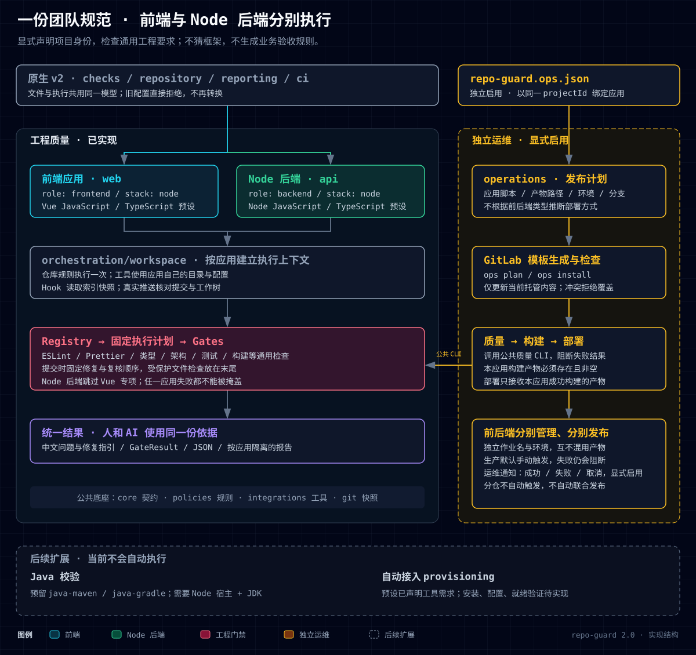

# repo-guard 项目结构与能力总览

适用于版本 `2.0.0`。

本文维护当前 **v2 配置模型、模块职责和扩展边界**。repo-guard 通过统一的 npm 命令入口约束 AI 与开发者的工程行为；前端和 Node 后端各自使用明确配置的工具、规则和执行目录，不承担接口契约、鉴权或其他业务验收判断。

产品用途见 [README](../README.md)，安装与配置见[使用说明](usage-guide.md)，单项能力见[功能索引](features/README.md)。交付资料与反馈流程统一维护在[交付合同手册](features/delivery-contract.md)。

当前为阶段性重构成果，内部配置统一和旧 CI 发布链路清理尚未完成。具体代码依据、后续任务和验收标准见 [2.0 重构剩余工作](refactor-2.0-remaining-work.md)。

## 项目结构与职责

### 1 工作模型：显式项目、共同检查引擎、独立运维



[打开可导出结构图](images/repo-guard-v2-architecture.html)

图中实线模块对应当前实现；底部虚线区域是后续扩展。Java 检查尚未提供，自动安装与基础配置生成也尚未实现，不应将预留身份或工具需求声明解释为接入就绪。

| 范围 | 明确由谁配置 | 当前执行方式 |
|---|---|---|
| 仓库公共规范 | 团队统一配置 `repository`、`reporting`、`ci` | 仓库级规则在公共上下文执行；依赖策略覆盖根包及应用包 |
| 前端应用 | 人或 AI 声明 `project.id / role / stack / preset` | 使用前端预设和应用目录中的工具与配置 |
| Node 后端应用 | 人或 AI 声明 `role: backend`、`stack: node` 及 Node 预设 | 复用工程检查，跳过 Vue 专项，不绑定具体后端框架 |
| 运维发布 | 运维或应用负责人配置独立的 `repo-guard.ops.json` | 按项目标识生成 GitLab 质量、构建和部署作业 |

项目身份只来自配置，不扫描文件或依赖来猜测前后端。环境、工具和脚本仍需检查是否与声明匹配。当前前端预设为 Vue JavaScript / TypeScript，后端预设为 Node JavaScript / TypeScript。

### 2 单应用与多应用

单应用将身份、检查与公共规则放在根目录 `repo-guard.config.json`。多应用由根配置的 `projects` 列表声明各应用目录和配置文件；子应用配置声明自己的 `project` 和 `checks`，不得覆盖仓库统一的 `repository / reporting / ci`。

```text
消费项目/
├─ package.json                    安装 repo-guard 的统一 npm 入口
├─ repo-guard.config.json           显式应用清单与仓库公共规则
├─ repo-guard.ops.json              可选：独立运维发布配置
├─ AGENTS.md                       仓库公共 AI 规范
└─ apps/
   ├─ web/
   │  ├─ repo-guard.config.json     前端身份与检查
   │  ├─ package.json              前端工具、测试和构建脚本
   │  └─ AGENTS.md                 前端适用的 AI 规范
   └─ api/
      ├─ repo-guard.config.json     Node 后端身份与检查
      ├─ package.json              后端工具、测试和构建脚本
      └─ AGENTS.md                 后端适用的 AI 规范
```

这些目录名称只是示例，实际位置由配置声明。应用目录不得重叠，配置路径不得越出所属目录；符号链接和目录联接也需满足实际路径边界。同仓各应用共用一个 Git Hook 入口，按应用建立 `GateContext`；从仓库根目录执行需要单个目标的命令时使用 `--project <id>`。

### 3 源码目录

```text
repo-guard/
├─ bin/                         npm bin 命令启动器
├─ src/
│  ├─ profiles/                 显式身份、预设组合和工具需求声明
│  ├─ config/                   v2 加载、校验、归一化与显式迁移
│  ├─ core/                     Gate、Context、Result、错误与基础执行
│  ├─ git/                      仓库、索引、提交、范围与 Worktree 事实
│  ├─ policies/                 工程规则、AI 规范与纯策略判断
│  ├─ integrations/             消费项目工具与第三方协议适配
│  ├─ gates/                    代码、测试、构建等统一检查能力
│  ├─ orchestration/
│  │  ├─ workspace/             应用目标选择、变更归属和配置快照
│  │  ├─ pre-commit/            单次 lint-staged 隔离与固定检查顺序
│  │  ├─ pre-push/              真实推送范围、快照验证与重型检查
│  │  ├─ ci/                    CI 中的质量执行与结果汇总
│  │  ├─ doctor/                按仓库及应用诊断接入状态
│  │  ├─ setup/                 显式初始化、托管 Hook 与资料同步
│  │  └─ cli/                   命令参数及各流程入口
│  └─ operations/
│     ├─ config/                独立运维配置及写入边界
│     ├─ pipeline/              按项目标识建立发布计划
│     ├─ providers/             Node 构建和部署脚本适配
│     ├─ gitlab/                流水线渲染、安装和检查
│     └─ notifications/         迁入的旧 GitLab 通知实现
├─ test/                        按功能分组的测试与公共辅助
├─ docs/features/               单项能力维护入口
├─ docs/images/                 图形及可导出的 HTML 源文件
├─ skills/                      提供给消费项目的交付流程 Skill
├─ .agents/skills/              本仓库维护者 Skill
├─ scripts/                     本仓库的检查、测试收集与打包验证
├─ config.schema.json           项目和工作区质量配置
├─ project.schema.json          子应用身份与检查配置
├─ operations.schema.json       独立运维配置
└─ package.json                 npm 入口、导出和维护命令
```

`provisioning` 是后续规划，不是当前已有目录。当前 `profiles` 只声明身份与工具需求，开启检查不会自动下载工具或生成第三方配置。

### 4 分层职责与依赖

| 层 | 应负责 | 不应负责 |
|---|---|---|
| `profiles` | 校验身份组合，声明运行环境和工具需求 | 猜项目类型、安装依赖、执行检查或部署 |
| `config` | 字段校验、v2 工作区读取、旧配置显式迁移 | Git 查询、工具执行和运维生成 |
| `core` | 稳定契约、结构化结果、错误、基础执行和输出能力 | 依赖具体 Gate、预设或运维实现 |
| `git` | 提供索引、提交和变更范围事实 | 判定规则是否通过 |
| `policies` | 比较工程事实与团队要求，生成 AI 指引 | 编排质量生命周期 |
| `integrations` | 调用消费项目工具，解析第三方输出 | 拥有门禁总顺序或最终团队策略 |
| `gates` | 执行单项能力，返回统一结果与证据 | 依赖 CLI、Hook 或 CI 编排实现 |
| `orchestration` | 建立可信上下文、固定计划、按应用调度与汇总 | 复制检查算法、直接调用工具适配器 |
| `operations` | 发布计划、产物约束、模板与通知 | 深层调用质量 Gate 或 orchestration；猜测部署流程 |

质量链路通过 Registry 调用 Gate；运维生成的作业通过公共 CLI 调用质量链路，运维模块不反向导入质量编排。旧模板和通知入口保留薄桥，实际实现集中到 `operations`；v2 外部质量配置已移除 `ci.pipeline`。

`core`、`profiles` 和 `config` 的底层边界、运维与质量编排的独立边界、Gate 领域边界、循环依赖及不可解析导入，由 `.dependency-cruiser.cjs` 和架构测试共同约束。结构调整应先判断职责归属，再修改依赖。

## 执行与可信结果

- **提交前**：根配置和子应用配置一起从索引读取；同一次 `lint-staged` 隔离两个应用的部分暂存内容。依次对各应用执行 Stylelint 修复、ESLint 修复、Prettier、只读复核和适用策略，仓库受保护文件门禁最后执行。
- **真实推送**：使用待推送提交的配置快照。启用重型检查时拒绝脏工作树、非当前 HEAD 或多个不同提交，避免测试其他代码后宣称待推送内容已通过。手动执行 `pre-push` 无 Git 输入时是本地工作树验证，不等同于真实推送快照验证。
- **CI**：公共规则与应用检查使用对应上下文；项目标识进入结果和产物命名，避免前后端报告覆盖。任一应用失败都不能被另一应用成功掩盖。
- **运维**：质量成功后构建，构建产物存在且非空后部署；应用之间独立命名、依赖和环境，生产手动触发。项目脚本、Runner 工具和平台发布权限由团队维护。

已接入配置的暂存删除、子应用配置快照缺失，以及推送时删除根配置会阻断执行，不能被当作“未接入”自动跳过。

| 契约 | 作用 |
|---|---|
| `project` / `profiles` | 固定项目身份、预设和适用范围 |
| `GateContext` / `ChangeSet` | 同时携带仓库根目录、应用根目录、项目身份和可信变更 |
| Registry / Execution Plan | 维护稳定能力 ID 与不可随意重排的执行顺序 |
| `GateResult` | 区分通过、跳过、违规、配置错误及执行错误，提供中文修复建议 |
| 运维发布计划 | 绑定同一应用的质量、构建、产物、分支和环境 |
| Delivery Contract / Evidence Run | 为团队启用的交付资料与反馈流程提供可核验依据 |

目前 v2 外部配置仍被归一化为旧的内部执行结构，这是尚待收尾的过渡实现。后续需统一配置校验、Gate 和执行计划，并将旧配置解析隔离到迁移模块。磁盘上的 v1 配置不能直接执行，需使用 `migrate` 明确提供项目身份并保存备份；旧运维设置存在定制时会阻断迁移，需人工拆分，不能静默丢弃。

可选提交动画位于 `core/report/commit-animation`，配置归属 `reporting.commitAnimation`，不注册为 Gate。动画不改变失败状态，成功庆祝只在真实 `post-commit` 后发生。详细说明见[提交动画](features/commit-animation.md)。

## 测试组织与扩展边界

测试按用途放在 `test/core`、`test/config`、`test/policies`、`test/gates`、`test/hooks`、`test/ci`、`test/operations`、`test/setup`、`test/architecture` 和 `test/docs` 等目录。共享工具放在 `test/helpers`，运行时临时项目放在忽略的 `test/.tmp`。测试入口明确收集 `.test.js` 文件，排除临时项目，不能把辅助脚本或样例误当测试运行。

新增功能的测试按实际职责归类，不再直接堆放到 `test` 根目录。跨应用集成应覆盖身份与目录隔离、报告隔离、失败汇总、索引一致性以及部分暂存恢复；新增工具适配还需验证实际消费项目的工具与脚本入口。

| 扩展方向 | 当前事实 | 后续实现边界 |
|---|---|---|
| Node 后端 | 已有 JS/TS 显式预设，共用工程检查 | 扩展工具时继续依赖项目自身安装与配置，不引入业务接口校验 |
| Java | 已预留 `java-maven` / `java-gradle` 身份，但执行明确拒绝 | 新增 Java 工具、报告和构建适配；Node 运行 repo-guard，JDK 运行 Java 检查 |
| 自动接入 | 已声明预设需要的运行环境与工具 | 独立建设准备计划、兼容性、安装、配置和就绪验证；日常 Hook 不负责安装 |
| 分仓协作 | 各仓库独立检查、生成本仓发布任务 | 后续显式增加跨仓协调，不能默认触发其他团队部署 |

## 文档职责与维护规则

| 文档 | 维护内容 |
|---|---|
| [README](../README.md) | 产品定位、用途和最短接入方式 |
| [使用说明](usage-guide.md) | v2 配置、功能开关、生命周期与日常命令 |
| [功能索引](features/README.md)与专题 | 功能用途、字段要求、运行结果、修复和测试依据 |
| [独立运维](features/operations.md) | 运维配置字段、应用产物、环境和平台约束 |
| [交付合同手册](features/delivery-contract.md) | 交付资料、人员分工、反馈和执行证据 |
| 本文与结构图 | 当前目录、职责、依赖与已实现/预留边界 |

每个行为变化同步代码测试、README/相关专题、Schema 和 CHANGELOG；能力变化同时维护功能索引。结构变化同步本文、SVG、HTML 与架构约束。配置示例、文档链接、测试入口和 npm 打包内容必须一并复核。

发布前执行 `npm run check`、`npm test`、`npm run pack:check`。本仓库的版本与发布流程统一维护在[发布 Skill](../.agents/skills/repo-guard-publishing/SKILL.md)。
