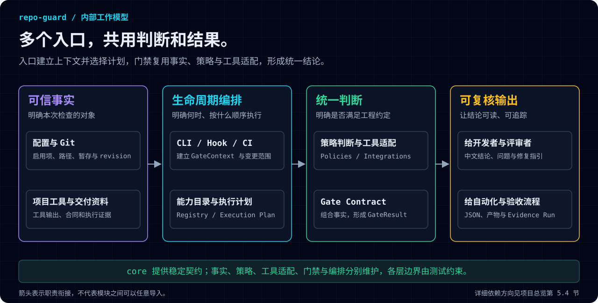

# repo-guard 项目结构与能力总览

本文作为**维护者架构说明**保留，适用于版本 `1.24.0`。只维护代码结构、模块职责、依赖方向和文档维护边界。使用原文件名是为了保持仓库约定与已有链接稳定。

产品介绍见 [README](../README.md)，安装配置见[使用说明](usage-guide.md)，单项能力见[功能说明文档索引](features/README.md)，完整交付流程见[交付合同手册](features/delivery-contract.md)。这些内容各自只有一个详细维护入口。

## 项目结构与职责

### 1 工作模型：多种入口，共用判断和结果



图中展示的是职责关系。实际执行时，CLI、Hook 或 CI 入口先建立可信上下文并选择固定计划，再通过 Registry 调度 Gate；Gate 使用事实、策略和工具适配形成统一结果。

| 概念 | 用容易理解的话说明 | 主要来源或产物 |
|---|---|---|
| 可信事实 | 本次到底检查哪个项目、哪份代码和哪些资料 | 配置与 Schema、Git 快照、消费项目工具、合同与证据 |
| 生命周期编排 | 本次在哪个入口、按什么顺序执行 | CLI、Git Hook、CI、Registry、Execution Plan |
| 统一判断 | 把事实与规则比较，判断是否符合约定 | Policies、Gate Contract、GateResult |
| 可复核输出 | 让人和自动化都能理解结论及其依据 | 中文修复指引、JSON、artifact、Evidence Run |

同一个 Gate 不因从 CLI、Git Hook 或 CI 进入而复制另一套判断逻辑。

### 2 目录导航

```text
repo/
├─ .agents/skills/       仓库维护者使用的本地 Codex Skill
├─ bin/                  CLI 启动器
├─ docs/
│  ├─ features/          单项功能说明与索引
│  ├─ images/            产品与架构 SVG、交付时序和反馈流程图源文件
│  └─ usage-guide.md     安装、配置和命令手册
├─ scripts/              仓库自身维护检查
├─ skills/               安装到消费项目的交付流程 Skill 源文件
├─ src/
│  ├─ config/            配置加载、默认值、验证和路径匹配
│  ├─ core/              稳定领域契约、结果、错误和基础执行能力
│  ├─ git/               Git 仓库、索引、revision 和 Worktree 事实
│  ├─ integrations/      消费项目工具与第三方协议适配
│  ├─ policies/          不带编排和外部写入的策略判断
│  ├─ gates/             策略到统一 GateResult 的能力适配
│  └─ orchestration/     CLI、Hook、CI、Doctor 和初始化编排
├─ test/                 单元、集成、端到端和架构边界测试
├─ *.schema.json         对外配置与报告 Schema
├─ package.json          npm 包入口、版本和维护脚本
└─ README.md             用户第一入口
```

### 3 分层职责

| 层 | 应负责 | 不应负责 |
|---|---|---|
| `config` | 加载、默认值、字段和跨字段验证 | Git 查询、运行门禁、生命周期编排 |
| `core` | Gate、Context、Result、Error、Execution Plan 等稳定契约 | 具体业务规则或第三方工具语义 |
| `git` | 提供索引、提交、范围、分支和 Worktree 事实 | 决定策略是否通过 |
| `integrations` | 调用并解析消费项目工具或第三方协议 | 拥有最终策略和用户主结论 |
| `policies` | 对已获得的事实进行确定性判断 | 执行外部命令、编排生命周期 |
| `gates` | 形成 finding、artifact 和统一 GateResult | 决定 CLI/Hook/CI 的总执行顺序 |
| `orchestration` | 建立上下文、选择固定计划、执行并汇总结果 | 复制具体 Gate 的判断逻辑 |

### 4 依赖方向

- `core` 不依赖 `gates`、`orchestration` 或 `integrations`。
- `config` 不依赖 Git、policy、gate、integration 或 orchestration 运行域。
- `git` 只提供仓库事实，不依赖策略和编排。
- `policies` 可以消费稳定事实，但不调用 gate 或 orchestration。
- `integrations` 不拥有策略决策和用户输出。
- `gates` 可以组合 core、config、Git、policy 和 integration，但不依赖 orchestration 或 renderer。
- `orchestration` 通过 Gate Registry 和 Execution Plan 调度能力，不直接调用具体 integration。
- 不同 gate 领域不互相深层导入；组合只放在 Registry 和 Execution Plan。
- 循环依赖和无法解析的本地导入都是错误。

这些边界由仓库测试与 dependency-cruiser 配置共同保护。结构变更必须先判断属于事实、策略、能力适配还是生命周期编排，不能因为调用方便而跨层复制实现。

## 稳定契约与输出

| 契约 | 作用 | 事实来源 |
|---|---|---|
| 配置 Schema | 约束允许字段、类型、枚举和公开配置边界 | 根目录 `*.schema.json` 与运行时配置验证 |
| Gate Contract | 声明稳定 ID、环境、副作用、超时、所需工具和执行生命周期 | `src/core/capability/` |
| Gate Registry | 官方能力目录；项目外部门禁只能追加，不能替换或重排官方能力 | Registry 定义与集合测试 |
| GateContext / ChangeSet | 让每个 Gate 使用同一个执行环境和 Git 变更范围 | 编排层建立的不可变上下文 |
| GateResult | 统一通过、跳过、违规和错误状态，以及 finding、artifact、diagnostic | 所有官方 Gate |
| Execution Plan | 固定 pre-commit、pre-push 和 CI 的能力顺序 | `src/orchestration/` 与计划测试 |
| Delivery Contract / Evidence Run | 绑定功能归属、需求事实、任务、反馈、人工确认与执行证据 | Git 中受跟踪的 Markdown 合同包和报告 |

npm 包根入口只公开稳定的配置、Gate 构造、Context、Result 和错误契约；具体 runner、Gate、integration 和 orchestration 属于内部实现。公开 Schema 以 `package.json` 的 `exports` 与实际 npm 打包结果为准。

提交动画属于可选报告展示能力，配置入口是 `commitAnimation`，不注册为 Gate。`core/report/commit-animation` 负责小猫、小狗、道具和彩蛋像素与终端生命周期；预提交编排提供真实阶段并在输出诊断前停止重绘，`lint-staged` 仍负责暂存隔离与恢复；提交信息编排只在 `post-commit` 入口播放成功庆祝。预览命令使用明确标记的模拟数据，不执行 Git 写入。详细行为见[提交动画](features/commit-animation.md)。

提交信息校验与动画道具共享 `core/policy/commit-header.js` 的标题语法；允许哪些类型仍由提交信息策略决定，动画只对默认十种类型提供道具。特殊与未知类型退回普通包裹。彩蛋类型和触发概率属于展示层内部实现，不进入项目配置。


## 文档职责与维护规则

| 文档 | 读者与职责 |
|---|---|
| [README](../README.md) | 首次了解项目的人：定位、主要用途、最短接入路径 |
| [使用说明](usage-guide.md) | 接入团队：规则开关及说明、生命周期、日常命令和诊断 |
| [功能说明文档索引](features/README.md) | 使用与维护单项能力的人：完整能力入口，详细用法在各专题 |
| [交付合同手册](features/delivery-contract.md) | 产品、研发、AI、测试：同一流程内的角色、合同、反馈和证据 |
| 本文 | 维护者：结构、职责、依赖和稳定契约 |
| [CHANGELOG](../CHANGELOG.md) | 版本历史和演进记录 |

- 新增、修改或删除能力时，同步功能索引、对应专题和使用说明入口；只有能力领域、生命周期、目录结构、模块职责或依赖方向变化时才更新本文，不复制功能配置全文。
- 结构、模块职责或依赖方向变化必须同步本文及架构测试。Registry 维护官方能力集合，Execution Plan 维护固定顺序，当前行为以实现和测试为依据。
- 本次文档分工调整：全部功能专题已补齐；交付登记、合同、证据、反馈集中维护在 `docs/features/delivery-contract.md`，交付 Skill 直接引用该手册，已删除旧格式页。
- 每项功能的文档随实现更新，包括用途、配置/调用、默认状态、生命周期、通过/跳过/失败、证据、修复和测试依据。新增能力不留空白占位页。
- 交付流程变化时同改统一手册、时序 SVG、反馈 SVG 与 Mermaid 源文件。Git 提供事实、repo-guard 校验规则、人工确认业务和验收的分工必须保持准确。
- 保留使用说明已有锚点或同步所有引用。文档校验覆盖配置示例、完整开关集合、文件与锚点、功能索引、配图及打包内容。
- 每个行为变化仍须同步代码测试、README/相关功能文档、配置 Schema 和 CHANGELOG；发布前执行 `npm run check`、`npm test`、`npm run pack:check`。
- 本仓库发布流程统一维护在[发布 Skill](../.agents/skills/repo-guard-publishing/SKILL.md)。
